 a)

 # H1 - oma Linux

Tässä harjoituksessa latasin VirtualBox-virtuualikoneohjelman ja asensin siihen Debian Linux -käyttöjärjestelmän. Asennuksen jälkeen tein eri alkumääritykset ja testasin järjestelmän toimivuuden. Tein harjoituksen lauantaina 18.1.2025 omalla tietokoneellani, jossa on Windows-käyttöjärjestelmä. Mielestäni harjoituksen haastavin osa oli raportin kirjoittaminen GitHubiin, sillä alusta ei ole vielä minulle kovin tuttu, ja sen käyttö vaatii totuttelua. 

## Debian ISO imagen asennus

Harjoitus alkoi Debian ISO -tiedoston lataamisella oman koneeni tiedostoihin. Lataus kesti muutaman minuutin.

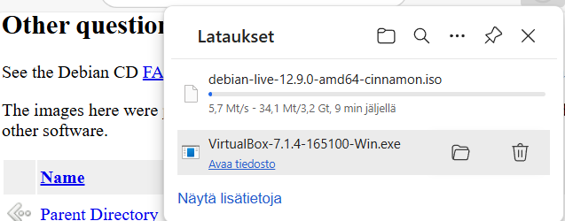

## VirtualBoxin asennus, virtuaalikoneen luominen sekä alkuasetusten määrittäminen

Seuraavaksi asensin tietokoneelleni VirtualBox-ohjelmiston, jonka avulla virtuaalikone luotiin ja ajettiin myöhemmin.

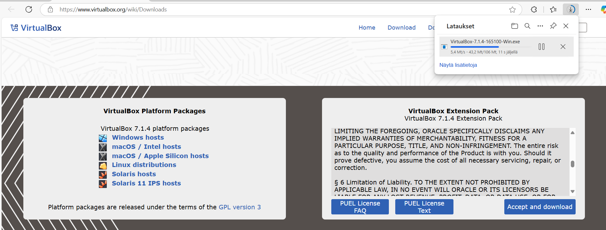
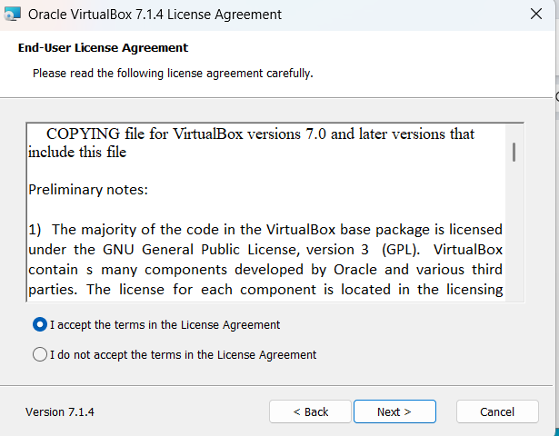
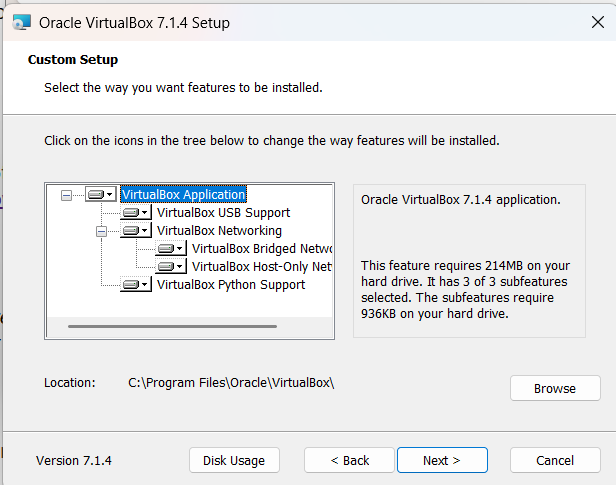
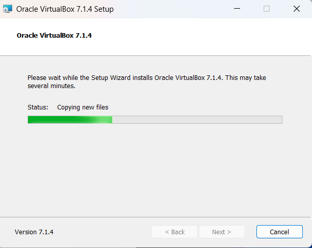

VirtualBoxin asennettuani loin oman Linux virtuaalikonen, jolle tein tarvittavat määritykset opettajan antamien ohjeiden mukaisesti. Tämä vaihe tuotti minulle hieman haasteita, sillä opettajan ohjeissa käytetyt näyttökuvat olivat vanhentuneita. Tämä sai minut epävarmaksi siitä, etenikö prosessi oikein.

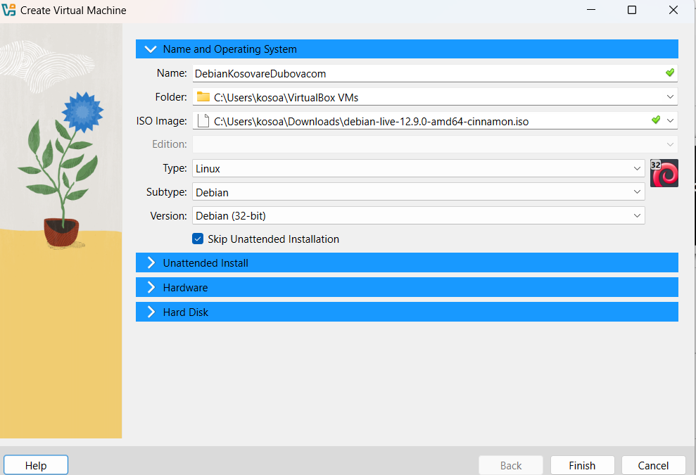
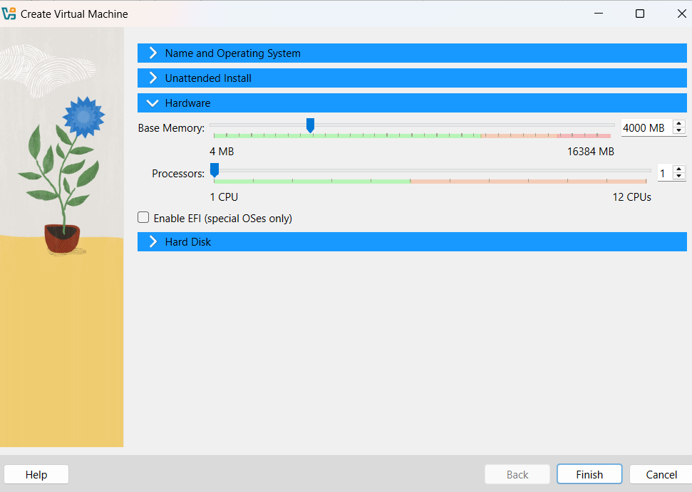
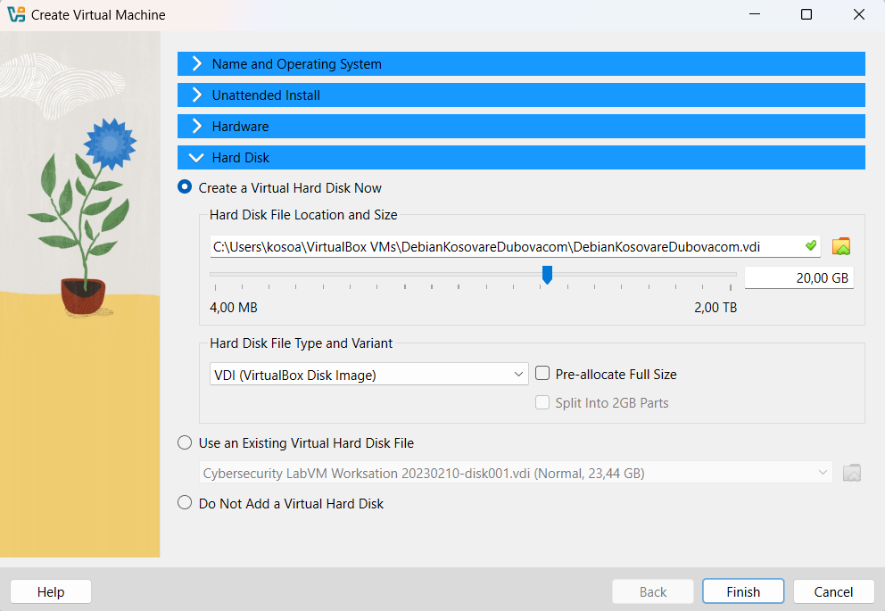

## Virtuaalikoneen käynnistäminen ja järjestelmän testaus

Seuraavassa vaiheessa käynnistin virtuaalikoneen ensimmäistä kertaa VirtualBoxissa ja testasin sen toimivuutta hakemalla verkosta "Tero Karvinen" -sivustoa. Tässä vaiheessa virtuaalikone toimi vielä Live-tilassa, mikä tarkoittaa, että käytin Debiania ilman sen asentamista järjestelmään.

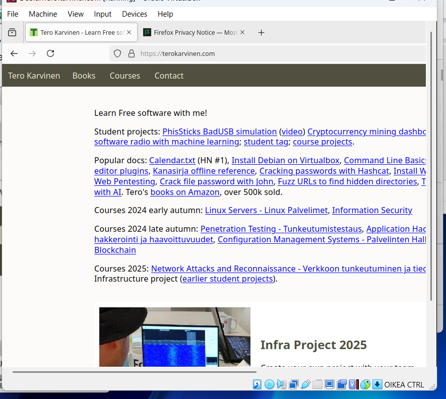

## Debianin asentaminen ja testaus 

Testauksen jälkeen siirryin Debianin asennukseen. Asennusprosessi eteni vaiheittain: määritin järjestelmän kielen ja sijainnin sekä käyttäjä- ja näppäimistöasetukset. Lopuksi järjestelmä asennettiin ja virtuaalikone käynnistettiin uudelleen.

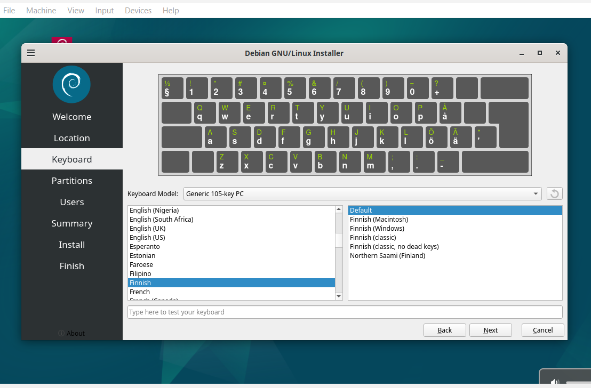
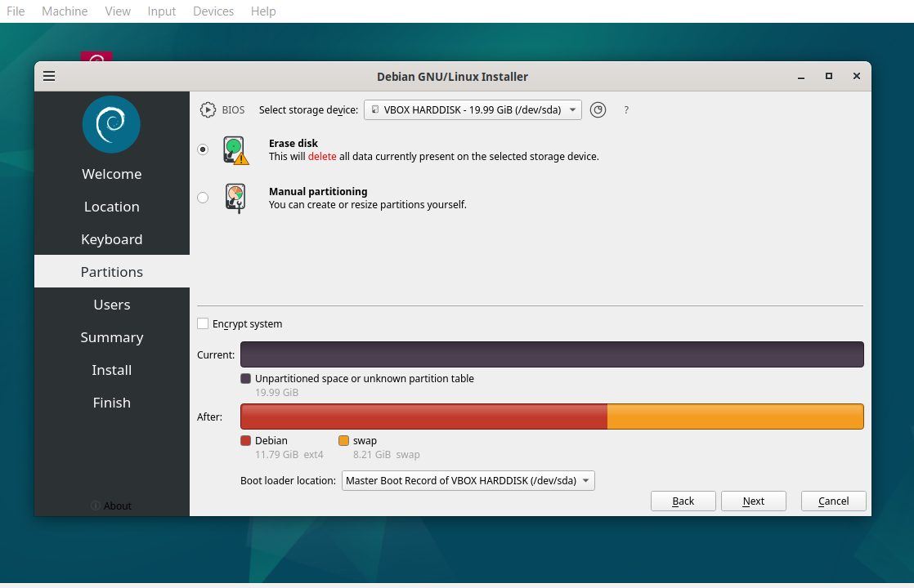
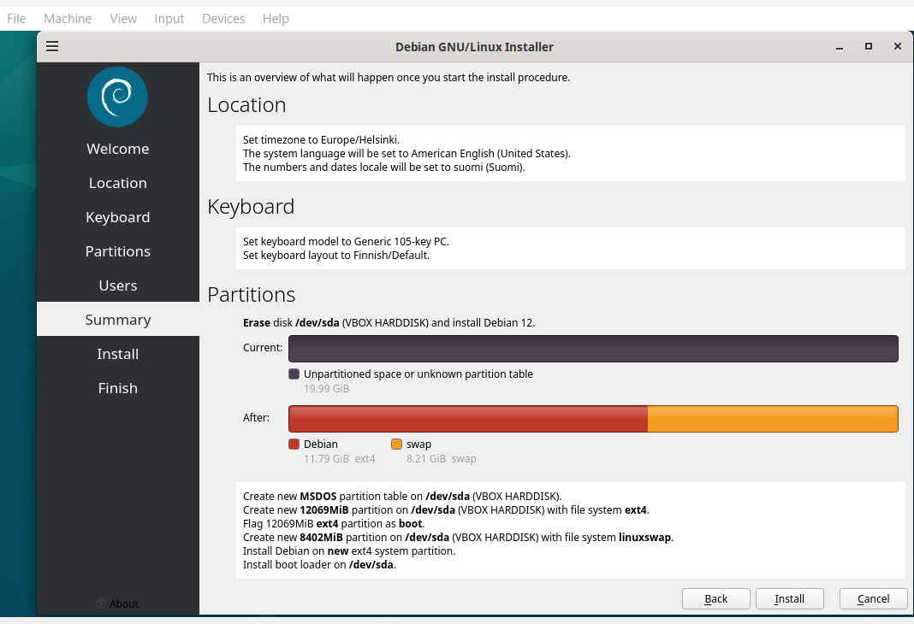
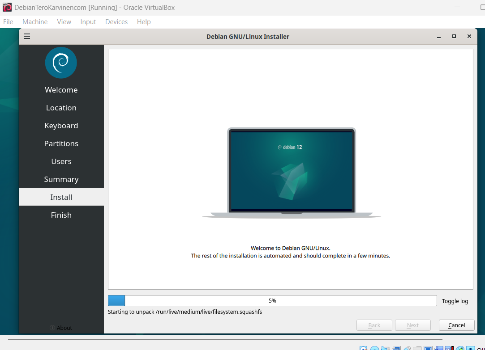
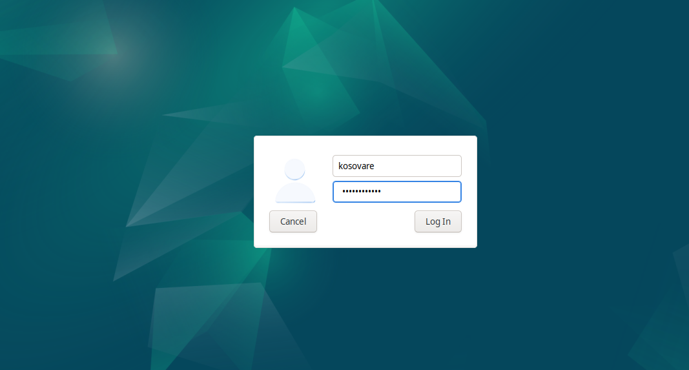

Lopuksi vielä testasin Debianin toimivuutta hakemalla taas verkosta "Tero Karvinen" -sivustoa. Kaikki asennuksessa tehdyt määritykset ja verkkoyhteys toimivat odotetusti.

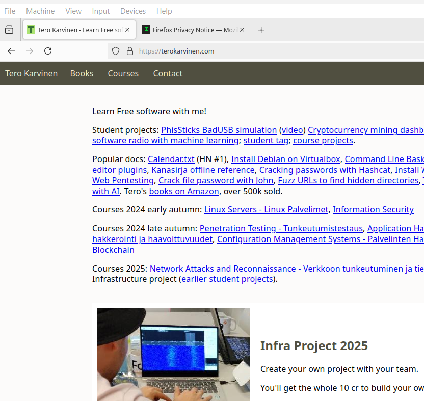

## Päivitysten tekeminen ja palomuurin asentaminen Debianilla

Debianin testaamisen jälkeen käynnistin virtuaalikoneen uudelleen, kirjauduin sisään ja suoritin järjestelmäpäivityksen komentoriviltä.

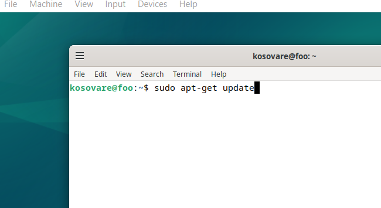
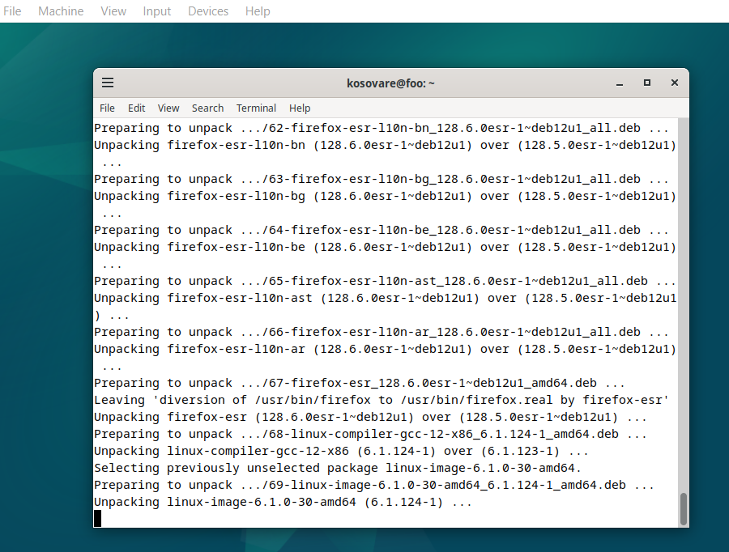

Järjestelmäpäivityksen jälkeen asensin palomuurin komentokehotteelta ja otin sen käyttöön.

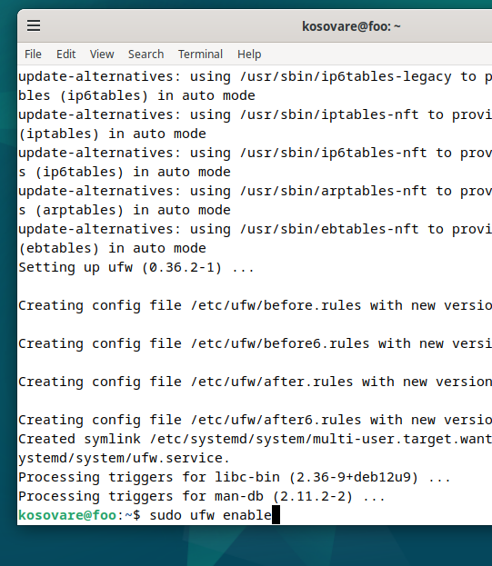

## Guest Additions

Harjoituksen lopuksi tein vapaavalintaisen osion, jossa asensin Guest Additions -ominaisuudet parantaakseni virtuaalikoneen näyttötarkkuutta ja mahdollistaakseni kopiointi- ja liittämistoiminnon oman koneeni ja virtuaalikoneeni välillä. 

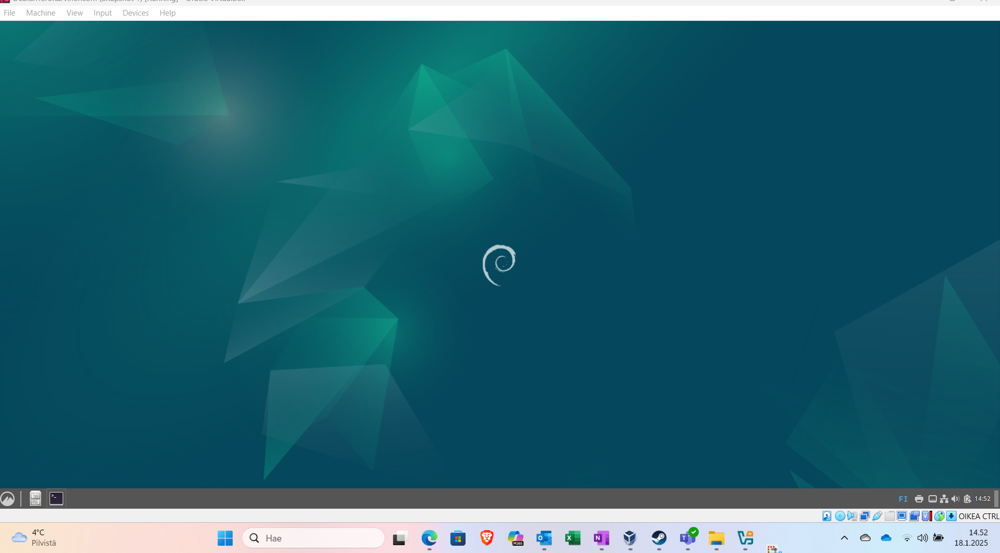

 x)

# H1 - vapaa ohjelmisto

Vapaa ohjelmisto tarkoittaa, että kuka tahansa saa käyttää, tutkia, muokata, kopioida ja jakaa ohjelmistoa. Vapaa (engl. "free") ei tarkoita, että ohjelmisto olisi ilmainen, vaan se viittaa käyttäjän oikeuksiin. Ohjelmisto on vapaa vain, jos se tarjoaa kaikki seuraavat neljä vapautta:

1. Vapaus käyttää ohjelmistoa käyttäjän haluamalla tavalla
  - Kuka tahansa voi käyttää ohjelmaa millä tahansa tietokoneella ja mihin tahansa tarkoitukseen. 
2. Vapaus tutkia ja muuttaa ohjelmistoa
  - Tämä tarkoittaa, että käyttäjä saa tarkastella alkuperäistä lähdekoodia ja voi muokata sitä haluamallaan tavallaan tai jopa poistaa sen kokonaan.  
3. Vapaus jakaa ohjelmistoa muille
  - Ohjelmasta voi jakaa muokkaamattomia versioita muille maksutta tai maksua vastaan.
4. Vapaus jakaa muokattuja versioita ohjelmistosta
  - Käyttäjä voi muokata ohjelmistoa ja jakaa muokattuja versioita muille.

# H1 - Tiivistelmä raportointiohjeista

Hyvässä raportoinnissa on kolme pääperiaatetta:

1. Toistettavuus: Raportin avulla testit tulee voida toistaa samoilla tuloksilla. Toistettavuuden takaamiseksi raportista on käytävä ilmi ympäristö, jossa tehtävä on suoritettu (missä, milloin ja millä laitteilla tai ohjelmilla).
2. Täsmällisyys: Raportissa on kuvattava tehtävässä annetut komennot, toimenpiteet ja niiden seuraukset. Onnistumiset ja epäonnistumiset tulee dokumentoida. Lisäksi raporttiin on kirjattava käytetyt työkalut, kellonajat ja mahdolliset vikailmoitukset.
3. Helppolukuisuus: Raportin tulee olla selkeästi jäsennelty ja kieliopillisesti oikein kirjoitettu.

Näiden lisäksi hyvässä raportissa viitataan asianmukaisesti käytettyihin lähteisiin. Vältettäviä virheitä ovat sepittäminen, plagiointi ja sellaisten kuvien käyttäminen, joihin ei ole lupaa.

## Lähteet:

GNU Operating System. What is Free Software? https://www.gnu.org/philosophy/free-sw.html

Karvinen T. 4.7.2006. https://terokarvinen.com/2006/raportin-kirjoittaminen-4/
 
