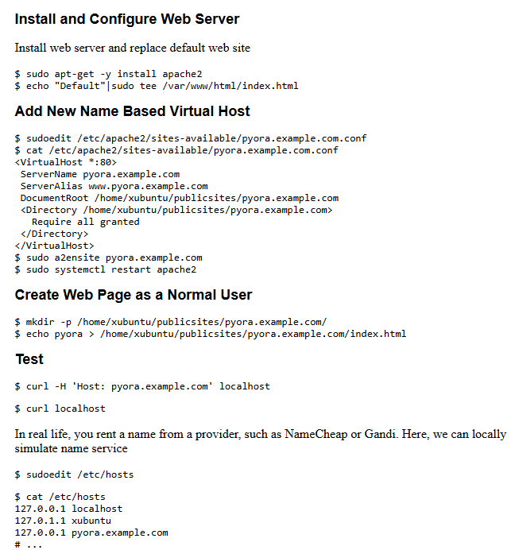

# H3 - Hello Web Server 

## Name-based virtual host support

#### IP-osoitteisiin perustuvat virtuaalipalvelimet: 
Ip-pohjaiset virtuaalipalvelimet tunnistavat oikean palvelimen sen IP-osoitteen perusteella. Tällöin jokaisella palvelimella tulee olla oma yksilöllinen ip-osoite.

#### Nimipohjaiset virtuaalipalvelimet:
Nimipohjaiset virtuaalipalvelimet useiden verkkosivustojen toimimisen samalla IP-osoitteella. Palvelin tunnistaa, mihin sivustoon pyyntö liittyy, käyttäjän selaimessa syötetyn osoitteen perusteella. 

#### Oikean virtuaali-isännän löytäminen: 
  1. Palvelin vastaanottaa pyynnön ja tarkistaa, löytyykö virtuaali-isäntä, jonka ip-osoite ja portti vastaavat pyyntöä. Ip-osoite ja portti löytyvät <VirtualHost>-lohkosta.
  2. Jos useita virtuaali-isäntöjä löytyy, palvelin käy läpi virtuaali-isännät ja vertaa niiden ServerName- ja ServerAlias-määrittelyjä.
  3. Jos sopivaa ServerName- tai ServerAlias-määrittelyä ei löydy, palvelin käyttää ensimmäistä virtuaali-isäntää, joka vastaa pyyntöä.

#### ServerName ja ServerAlias:
On tärkeää määrittää ServerName ja ServerAlias oikein, jotta palvelin löytää oikean verkkosivuston. Jos ServerName ei ole määritelty, se peritään se pääkonfiguraatiosta, mikä voi aiheuttaa ongelmia virtuaali-isännän löytämisessä. 
 
## Name Based Virtual Hosts on Apache – Multiple Websites to Single IP Address

Apache-palvelimella on mahdollista isännöidä useita verkkosivustoja yhdellä IP-osoitteella. Tämä onnistuu asentamalla Apache-palvelin, muokkaamalla sen määrityksiä, ja aktivoimalla virtuaalipalvelimet. Lopuksi palvelin käynnistetään, ja luodaan hakemistot sekä verkkosivut. Alla on kuva prosessista, jonka kuvasin edellä. 

## Lähteet: 

Apache. Luettavissa: https://www.2kmediat.com/apache/apache_konfiguraatio12.asp. Luettu 29.1.2025.
Name-based virtual host support. Luettavissa: https://httpd.apache.org/docs/2.4/vhosts/name-based.html. Luettu 29.1.2025. 
