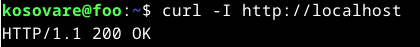
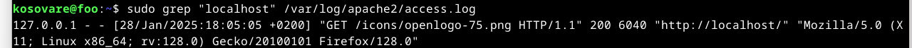

# H3 - Hello Web Server 

## Name-based virtual host support

#### IP-osoitteisiin perustuvat virtuaalipalvelimet: 
Ip-pohjaiset virtuaalipalvelimet tunnistavat oikean palvelimen sen IP-osoitteen perusteella. Tällöin jokaisella palvelimella tulee olla oma yksilöllinen ip-osoite.

#### Nimipohjaiset virtuaalipalvelimet:
Nimipohjaiset virtuaalipalvelimet useiden verkkosivustojen toimimisen samalla IP-osoitteella. Palvelin tunnistaa, mihin sivustoon pyyntö liittyy, käyttäjän selaimessa syötetyn osoitteen perusteella. 

#### Oikean virtuaali-isännän löytäminen: 
  1. Palvelin vastaanottaa pyynnön ja tarkistaa, löytyykö virtuaali-isäntä, jonka ip-osoite ja portti vastaavat pyyntöä. Ip-osoite ja portti löytyvät <VirtualHost>-lohkosta.
  2. Jos useita virtuaali-isäntöjä löytyy, palvelin käy läpi virtuaali-isännät ja vertaa niiden ServerName- ja ServerAlias-määrittelyjä.
  3. Jos sopivaa ServerName- tai ServerAlias-määrittelyä ei löydy, palvelin käyttää ensimmäistä virtuaali-isäntää, joka vastaa pyyntöä.

#### ServerName ja ServerAlias:
On tärkeää määrittää ServerName ja ServerAlias oikein, jotta palvelin löytää oikean verkkosivuston. Jos ServerName ei ole määritelty, se peritään se pääkonfiguraatiosta, mikä voi aiheuttaa ongelmia virtuaali-isännän löytämisessä. 
 
## Name Based Virtual Hosts on Apache – Multiple Websites to Single IP Address

Apache-palvelimella on mahdollista isännöidä useita verkkosivustoja yhdellä IP-osoitteella. Tämä onnistuu asentamalla Apache-palvelin, muokkaamalla sen määrityksiä, ja aktivoimalla virtuaalipalvelimet. Lopuksi palvelin käynnistetään, ja luodaan hakemistot sekä verkkosivut. Alla on kuva prosessista, jonka kuvasin edellä. 

b) 
Testasin, että web-palvelin toimii localhost-osoitteessa.

c)
Tässä harjoituksessa etsin lokista rivit, jotka syntyivät, kun latasin omalta palvelimeltani yhden sivun. Otin tarkasteluun ensimmäisen riven, joka tulostui annettuani komennon sudo grep "localhost" /var/log/apache2/access.log. 

- "127.0.0.1" kertoo pyynnön tehneen käyttäjän ip-osoite eli tässä tapauksessa minun omasta koneestani
- "--" kertoo käyttäjän käyttäjätunnuksen, mikäli se olisi määritelty
- "[28/Jan/2025:18:05:05 +0200]" kertoo ajan, jolloin pyyntö tehtiin
- "GET /icons/openlogo-75.png HTTP/1.1" kertoo, että käyttäjä halusi ladata tiedoston "/icons/openlogo-75.png" ja pyyntö tehtiin HTTP/1.1 -versiona.
- "200" on HTTP-vastauskoodi, joka kertoo, että pyyntö onnistui
- "6040" kertoo tiedoston koon tavuina
- "http://localhost/" kertoo mihin url-osoitteeseen pyyntö tehtiin
- "Mozilla/5.0 (X11; Linux x86_64; rv:128.0) Gecko/20100101 Firefox/128.0" kertoo, että käyttäjän selain oli Mozilla Firefox ja käyttöjärjestelmä oli Linux

c)

## Lähteet: 

Apache. Luettavissa: https://www.2kmediat.com/apache/apache_konfiguraatio12.asp. Luettu 29.1.2025.
How do I enable/disable a website hosted with Apache? Luettavissa: https://www.linode.com/community/questions/311/how-do-i-enabledisable-a-website-hosted-with-apache#:~:text=To%20enable%20or%20disable%20a%20site%20hosted%20with,respectively.%20Both%20commands%20use%20essentially%20the%20same%20syntax%3A. Luettu: 31.1.2025.
Isaiah A. 23.11.2023. How to View and configurate Apache access & error logs. Luettavissa: https://betterstack.com/community/guides/logging/how-to-view-and-configure-apache-access-and-error-logs/. Luettu: 31.1.2025.
Name-based virtual host support. Luettavissa: https://httpd.apache.org/docs/2.4/vhosts/name-based.html. Luettu 29.1.2025. 
