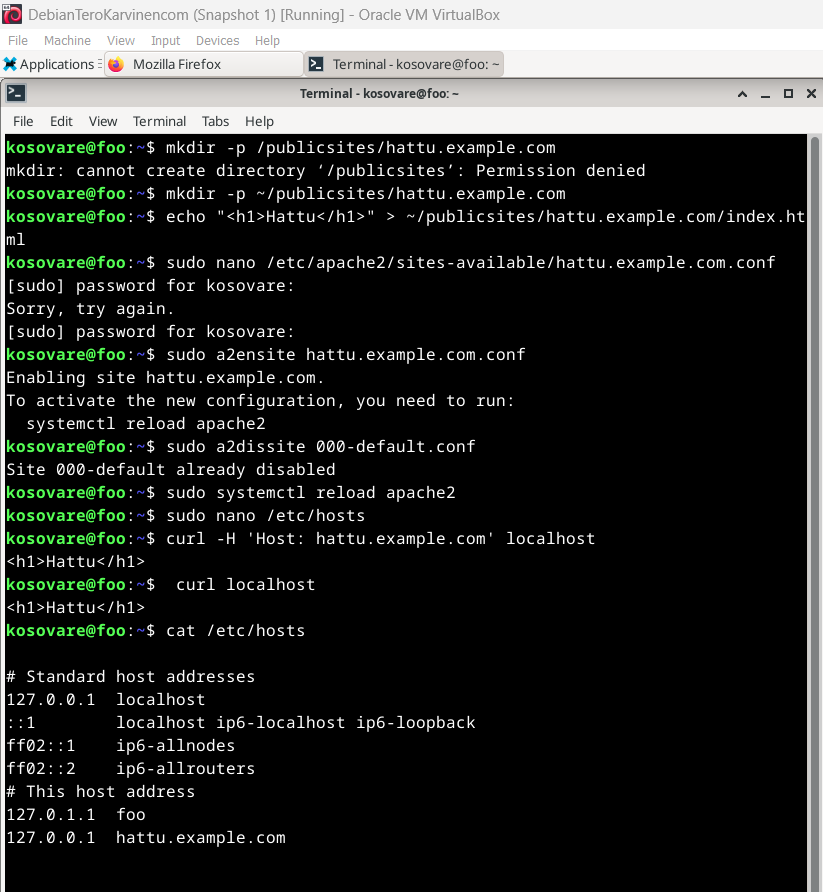
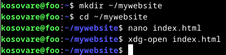

# H3 - Hello Web Server 

## x) Name-based virtual host support

#### IP-osoitteisiin perustuvat virtuaalipalvelimet: 
Ip-pohjaiset virtuaalipalvelimet tunnistavat oikean palvelimen sen IP-osoitteen perusteella. Tällöin jokaisella palvelimella täytyy olla oma yksilöllinen ip-osoite.

#### Nimipohjaiset virtuaalipalvelimet:
Nimipohjaiset virtuaalipalvelimet mahdollistavat useiden verkkosivustojen toimimisen samalla IP-osoitteella. Palvelin tunnistaa, mihin sivustoon pyyntö liittyy käyttäjän selaimessa syötetyn osoitteen perusteella. 

#### Oikean virtuaali-isännän löytäminen: 
  1. Palvelin vastaanottaa pyynnön ja tarkistaa, löytyykö virtuaali-isäntä, jonka ip-osoite ja portti vastaavat pyyntöä. Ip-osoite ja portti määritellään <VirtualHost>-lohkossa.
  2. Jos useita virtuaali-isäntiä löytyy, palvelin käy läpi virtuaali-isännät ja vertaa niiden ServerName- ja ServerAlias-määrittelyjä pyyntöön tulevaan isäntänimeen.
  3. Jos sopivaa ServerName- tai ServerAlias-määrittelyä ei löydy, palvelin käyttää ensimmäistä virtuaali-isäntää, joka vastaa pyyntöä.

#### ServerName ja ServerAlias:
On tärkeää määrittää ServerName ja ServerAlias oikein, jotta palvelin löytää oikean verkkosivuston. Jos ServerName ei ole määritelty, se peritään se pääkonfiguraatiosta, mikä voi aiheuttaa ongelmia virtuaali-isännän löytämisessä. 
 
## x) Name Based Virtual Hosts on Apache – Multiple Websites to Single IP Address

Apache-palvelimella on mahdollista isännöidä useita verkkosivustoja yhdellä IP-osoitteella. Tämä onnistuu asentamalla Apache-palvelin, muokkaamalla sen määrityksiä ja aktivoimalla virtuaalipalvelimet. Lopuksi palvelin käynnistetään, ja luodaan hakemistot sekä verkkosivut. Alla on kuva prosessista, jonka esittelin edellä. 

## a) Web-palvelu

Tässä harjoituksessa testasin, että web-palvelin toimii localhost-osoitteessa.

## b) Lokin rivit

Tässä harjoituksessa etsin lokista rivit, jotka syntyivät, kun latasin yhden sivun omalta palvelimeltani. Tarkastelin ensimmäistä riviä, joka tulostui, kun annoin komennon sudo grep "localhost" /var/log/apache2/access.log.

- "127.0.0.1" kertoo pyynnön tehneen käyttäjän ip-osoitteen, eli tässä tapauksessa oman koneeni ip-osoitteen.

- "--" tarkoittaa käyttäjätunnusta, mutta koska sitä ei ole määritelty, se jää tyhjäksi.

- "[28/Jan/2025:18:05:05 +0200]" kertoo tarkan ajan, jolloin pyyntö tehtiin, ja aikavyöhykkeen (+0200).

- "GET /icons/openlogo-75.png HTTP/1.1" kertoo, että käyttäjä teki GET-pyynnön tiedostolle "/icons/openlogo-75.png" käyttäen HTTP/1.1 versiota.

- "200" on HTTP-vastauskoodi, joka tarkoittaa, että pyyntö onnistui.

- "6040" kertoo tiedoston koon tavuina (6040 tavua).

- "http://localhost/" kertoo URL-osoitteen, johon pyyntö tehtiin.

- "Mozilla/5.0 (X11; Linux x86_64; rv:128.0) Gecko/20100101 Firefox/128.0" kertoo, että käyttäjän selain oli Mozilla Firefox ja käyttöjärjestelmä oli Linux.

## c) Etusivu uusiksi

Tässä harjoituksessa loin uuden name-based virtual hostin ja määritin sen niin, että uusi etusivu näkyy palvelimen oletussivuna osoitteessa http://localhost. Sivun nimeksi tuli hattu.example.com, ja sen sisällön piti olla muokattavissa normaalina käyttäjänä ilman sudo-oikeuksia. Poistin vanhan verkkosivuston käytöstä, ja aktivoin uuden sivun. Tässä tehtävässä hyödynsin kurssiopettajan ohjeita "Name Based Virtual Hosts on Apache – Multiple Websites to Single IP Address" sekä ChatGPT:tä varmistaakseni, että kaikki vaiheet oli suoritettu oikein ja tehtävänanto täytetty vaatimusten mukaisesti. Alla on kuvat eri vaiheista, sekä lopuksi testauksesta. Sivu toimii odotetusti, kuten viimeisestä kuvasta näkyy.

## e) HTML5-sivu

Tässä tehtävässä loin HTML5-sivun, tallensin sen tietokoneelleni ja avasin selaimessa. Ensin loin komentorivillä komennolla mkdir ~/mywebsite kansion, johon tallensin tiedoston index.html.

Tiedostoon kirjoitin HTML5-sivun sisällön, jonka kopioin opettajan ohjeesta "Short HTML5 page". 

Seuraavaksi testasin sivun toimivuutta selaimessa ja sivu toimi odotetusti. 

Lopuksi suoritin vielä testin sivun validiteetista osoitteessa https://validator.w3.org

Lisäys 03.02.2025:

Kurssilainen huomasi oivasti, että en ollut maininnut raportissani, teinkö validaattorin ehdottamia muutoksia HTML-koodiin vai en. Tein korjaukset ja testasin tiedoston validaattorissa uudelleen, mutta unohdin mainita asian raportissani. Alla vielä kuva uuden testin tuloksista.

## f) Curl ja curl-I

Curl on työkalu, jolla voi lähettää ja vastaanottaa tietoa internetissä. Sitä käytetään usein verkkosivujen hakemiseen ja tiedostojen lataamiseen.

Curl -I -komento näyttää verkkosivun vastauksen sekä palvelimen lähettämät otsakkeet. Otsakkeet sisältävät tietoa, kuten onko pyyntö onnistunut (esim. 200 OK) ja minkä tyyppistä sisältöä palvelin lähettää.

HTTP: kertoo HTTP-version ja onko pyyntö onnistunut. Esimerkiksi: HTTP/2 200 OK tarkoittaa, että käytössä on HTTP/2, ja pyyntö onnistui (200 OK).
Content-Type: kertoo sivun sisällöstö. Esimerkiksi text/html; charset=ISO-8859-1 tarkoittaa, että sisältö on HTML-muotoista ja käyttää ISO-8859-1. 
Date: kertoo milloin palvelin lähetti vastauksen. Esimerkiksi Sun, 02 Feb 2025 13:13:59 GMT.

## Lähteet: 

Apache. Luettavissa: https://www.2kmediat.com/apache/apache_konfiguraatio12.asp. Luettu 29.1.2025.

Curl main page. Luettavissa: https://curl.se/docs/manpage.html. Luettu 2.2.2025.

Curl -i command. Luettavissa: https://apidog.com/articles/curl-i-command/. Luettu: 2.2.2025.

How do I enable/disable a website hosted with Apache? Luettavissa: https://www.linode.com/community/questions/311/how-do-i-enabledisable-a-website-hosted-with-apache#:~:text=To%20enable%20or%20disable%20a%20site%20hosted%20with,respectively.%20Both%20commands%20use%20essentially%20the%20same%20syntax%3A. Luettu: 31.1.2025.

Saive R. How ro Host a Website on an Apache Web Server. Luettavissa: https://www.ubuntumint.com/install-apache-in-linux/. Luettu: 2.2.2025.

Isaiah A. 23.11.2023. How to View and configurate Apache access & error logs. Luettavissa: https://betterstack.com/community/guides/logging/how-to-view-and-configure-apache-access-and-error-logs/. Luettu: 31.1.2025.

Name-based virtual host support. Luettavissa: https://httpd.apache.org/docs/2.4/vhosts/name-based.html. Luettu 29.1.2025. 
