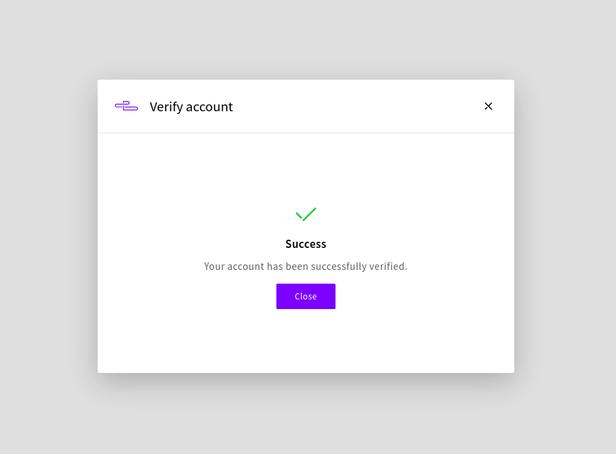
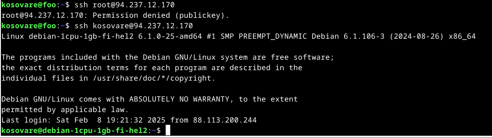
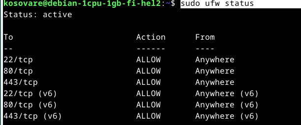

# H4

a)

Tässä harjoituksessa tarkoituksena oli vuokrata oma virtuaalipalvelin. Päätin vuokrata palvelimen UpCloudista. Ihan ensimmäisenä loin Upcloudissa käyttäjätilin. 

Seuraavaksi aloitin virtuaalipalvelimen käyttöönoton ja määrittelin siihen liittyvät asetukset. Aluksi valitsin palvelimen sijainniksi Helsingin. Plan-osiossa valitsin UpCloudin edullisimman palvelinpaketin, joka sisältää 1-core prosessoriytimen, 1 GB muistia ja 10 GB tallennustilaa hintaan 3 €/kk. Jätin automaattiset varmuuskopiot -osion sekä verkkoyhteydet -osion oletusasetuksille. Käyttöjärjestelmäksi valitsin Debian GNU/Linux 12 (Bookworm). Kirjautumistavaksi valitsin SSH-avaimen.

Seuraavaksi oli aika luoda ssh-avain. Olen aiemmin asentanut OpenSSH-ohjelma, joten minun ei tarvinnut tehdä mitään asennustoimia. Aloitin suoraan komennolla ssh-keygen, joka generoi uuden ssh-avaimen. Avain koostuu julkisesta ja yksityisestä osasta, ja ne tallennettiin oletuksena hakemistoon /home/kosovare/.ssh/. Julkinen avain tallennettiin tiedostoon id_rsa.pub ja yksityinen avain tiedostoon id_rsa. Lopuksi hain julkisen ssh-avaimen micro-tekstieditorissa ja liitin sen UpCloudin käyttöliittymään.

  micro $HOME/.ssh/id_rsa.pub # -> tällä löytyi 

  

b)

Tässä harjoituksessa tein virtuaalipavelimellani alkutoimet: suljin root-tunnuksen, laitoin tulimuurin päälle ja päivitin ohjelmat. 

Suljin root-tunnuksen opettajan ohjeiden mukaisesti seuraavien vaiheiden avulla:

Root-tunnuksen poiston jälkeen lopputilanne oli seuraava: 

Jatkoin seuraavaksi tulimuurin käynnistämisellä. Aloitin päivittämällä ohjelmat ja paketit komennolla sudo apt-get update. Kun päivitys oli valmis, asensin palomuurin komennolla sudo apt-get install ufw.

Ennen tulimuurin käynnistämistä tein siihen reiän komennolla sudo ufw allow 22/tcp. Käynnistin tulimuurin lopuksi komennolla sudo ufw enable. 

Lopuksi päivitin palvelimeni ohjelmat komennoilla sudo apt-get update ja sudo apt-get upgrade. Lisäksi suoritin komennon sudo apt-get dist-upgrade, joka päivittää ohjelmat ja paketit kattavammin.

c)

Tässä harjoituksessa asensin virtuaalipalvelimelleni oman web-palvelimen (Apache), ja korvasin sen oman oletussivun. Apachen asennus alkoi komennolla sudo apt-get install apache2. Seuraavaksi käynnistin apachen komennolla sudo systemctl start apache2 ja muokkasin sivua 

Tässä harjoituksessa asensin virtuaalipalvelimelleni oman web-palvelimen (Apache), ja korvasin sen oletussivun. Apachen asennus alkoi komennolla sudo apt-get install apache2. Seuraavaksi käynnistin apachen komennolla sudo systemctl start apache2 ja tarkistin, että palvelin oli käynnissä osoitteella http://94.237.12.170, jolloin näkyi Apache:n oletustestisivu. 

Tämän jälkeen muokkasin sivua. Apache:n oletussivun tiedosto sijaitsee /var/www/html/index.html, ja korvasin sen omalla HTML-sivullani. Avasin tiedoston tekstieditorilla komennolla sudo nano /var/www/html/index.html ja lisäsin siihen oman sisällön.

Kun olin tallentanut oman sivuni, kokeilin, että se näkyy julkisesti kirjoittamalla palvelimen IP-osoitteen selaimeen (http://94.237.12.170/).

Testasin lopuksi sivun toimivuutta vielä omalla puhelimellani. Sivu toimi odotetusti. 

### Lähteet:

Karvinen T. Luettavissa: https://terokarvinen.com/2017/first-steps-on-a-new-virtual-private-server-an-example-on-digitalocean/. Luettu 8.2.2025.
Karvinen T. Luettavissa: https://terokarvinen.com/linux-palvelimet/#h4-maailma-kuulee. Luettu 8.2.2025.

