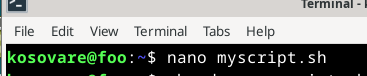
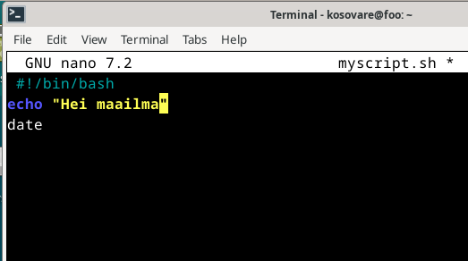
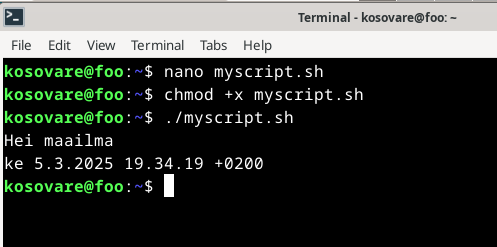
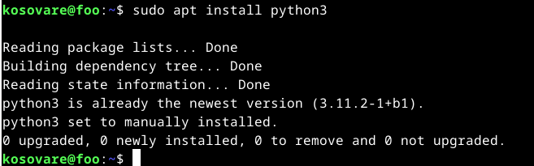
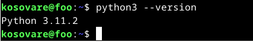
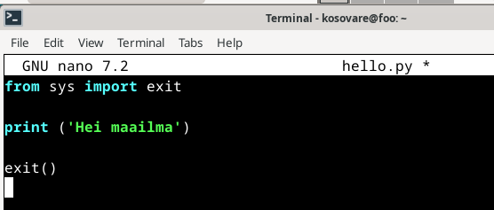
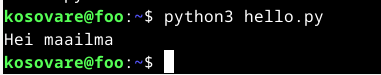
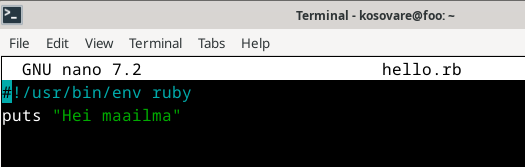
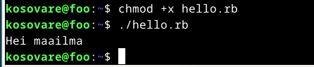

# H7 - Maalisuora

## a)

Tässä harjoituksessa tarkoituksena oli kirjoittaa ja suorittaa "Hei maailma" -ohjelma kolmella eri ohjelmointikielellä. Valitsin kieliksi Bashin, Pythonin ja

### Bash

Aloitin Bashilla. Ensin loin uuden skriptitiedoston nano-editorilla komennolla nano myscript.sh. 

Tiedoston ensimmäiselle riville lisäsin shebang-rivin #!/bin/bash, joka kertoo, että skripti suoritetaan bashilla. Seuraavaksi kirjoitin tiedostoon rivit echo Hei maailma ja date, jotka tulostavat "Hei maailma" ja näyttävät nykyisen päivämäärän ja ajan. Tallensin tiedoston painamalla Ctrl + X, minkä jälkeen editorin alareunaan tuli kysymys "Save modified buffer?". Kirjoitin "y", ja tiedosto tallentui.

Lopuksi tein skriptistä suoritettavan komennolla chmod +x myscript.sh. Tämän jälkeen ajoin skriptin komennolla ./myscript.sh.

### Python

Aloitin harjoituksen päivittämällä järjestelmän ohjelmistot ja asentamalla saatavilla olevat päivitykset komennoilla sudo apt update ja sudo apt upgrade. Seuraavaksi asensin Pythonin komennolla sudo apt install python3.

Testasin, että Python toimii komennolla python3 --version, joka palautti Pythonin versionumeron, mikä vahvistaa, että se on asennettu ja toimii oikein.

Loin uuden python-tiedoston komennolla nano hello.py. Siirryin nano-editoriin ja kirjoitin seuraavan sisällön:

Tallensin tiedoston, palasin komentoriville ja suoritin juuri luomani komennon komennolla python3 hello.py.

### Ruby

Aloitin tämänkin harjoituksen ensin asentamalla uuden ohjelmointikielen Ruby komennolla sudo apt install ruby. Seuraavaksi loin ruby-tiedoston nano-editorilla komennolla nano hello.rb. Siirryin nano-editoriin ja kirjoitin tiedostoon seuraavan sisällön: 

Tallensin tiedoston ja palasin komentoriville, jossa suoritin komennon chmod +x hello.rb, joka teki tiedostosta suoritettavan. Tämän jälkeen ajoin komennon ./hello.rb, ja ohjelma tulosti "Hei maailma".

Lähteet:

https://www.geeksforgeeks.org/custom-commands-linux-terminal/

https://www.geeksforgeeks.org/how-to-install-python-on-linux/

https://www.jcchouinard.com/create-python-script-from-terminal/

https://stackify.com/install-ruby-on-ubuntu-everything-you-need-to-get-going/#:~:text=Install%20Ruby%20on%20Ubuntu%20with%20APT%201%20Step,step%20is%20mostly%20for%20our%20own%20edification.%20

https://flatironschool.com/blog/building-your-first-command-line-application-in-ruby/
