# H7 - Maalisuora

## a)

Tässä harjoituksessa tarkoituksena oli kirjoittaa ja suorittaa "Hei maailma" -ohjelma kolmella eri ohjelmointikielellä. Valitsin kieliksi Bashin, Pythonin ja Rubyn.

### Bash

Tehtävän suorituspäivä: 4.3.2025.

Loin uuden skriptitiedoston nano-editorilla komennolla nano myscript.sh. 

Tiedoston ensimmäiselle riville lisäsin "#!/bin/bash", joka kertoo, että skripti suoritetaan bashilla. Seuraavaksi kirjoitin tiedostoon rivit "echo Hei maailma ja date", jotka tulostavat "Hei maailma" ja näyttävät nykyisen päivämäärän ja ajan. Tallensin tiedoston painamalla Ctrl + X, minkä jälkeen editorin alareunaan tuli kysymys "Save modified buffer?". Kirjoitin "y", ja tiedosto tallentui.

Lopuksi tein skriptistä suoritettavan komennolla chmod +x myscript.sh. Tämän jälkeen ajoin skriptin komennolla ./myscript.sh.

### Python

Tehtävän suorituspäivä: 5.3.2025.

Päivitin järjestelmän ohjelmistot ja asensin saatavilla olevat päivitykset komennoilla sudo apt update ja sudo apt upgrade. Seuraavaksi asensin Pythonin komennolla sudo apt install python3.

Testasin, että Python toimii komennolla python3 --version, joka palautti Pythonin versionumeron, mikä vahvistaa, että Python on asennettu oikein.

Loin uuden python-tiedoston komennolla nano hello.py. Siirryin nano-editoriin ja kirjoitin seuraavan sisällön:

Tallensin tiedoston, palasin komentoriville ja suoritin juuri luomani komennon komennolla python3 hello.py.

### Ruby

Tehtävän suorituspäivä: 5.3.2025.

Aloitin harjoituksen asentamalla Rubyn komennolla sudo apt install ruby. Seuraavaksi loin ruby-tiedoston nano-editorilla komennolla nano hello.rb. Siirryin nano-editoriin ja kirjoitin tiedostoon seuraavan sisällön: 

Tallensin tiedoston ja palasin komentoriville, jossa suoritin komennon chmod +x hello.rb, joka teki tiedostosta suoritettavan. Tämän jälkeen ajoin komennon ./hello.rb, ja ohjelma tulosti "Hei maailma".

Lähteet:

https://www.geeksforgeeks.org/custom-commands-linux-terminal/

https://www.geeksforgeeks.org/how-to-install-python-on-linux/

https://www.jcchouinard.com/create-python-script-from-terminal/

https://stackify.com/install-ruby-on-ubuntu-everything-you-need-to-get-going/#:~:text=Install%20Ruby%20on%20Ubuntu%20with%20APT%201%20Step,step%20is%20mostly%20for%20our%20own%20edification.%20

https://flatironschool.com/blog/building-your-first-command-line-application-in-ruby/

## c) Komento kaikille käyttäjille

Tehtävän suorituspäivä: 7.3.2025.

Tässä harjoituksessa tavoitteena oli luoda uusi komento, jota kaikki käyttäjät voivat käyttää. Toteutin tämän aiemmin luomastani Bash-skriptistä (myscript.sh).

Kopioin skriptin järjestelmän hakemistoon komennolla sudo cp myscript.sh /usr/local/bin/myscript.

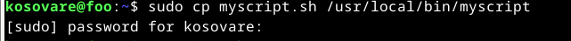

Lopuksi testasin, että komento toimii suoritin komennon myscript.

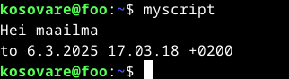

Lähteet: 

https://terokarvinen.com/2007/12/04/shell-scripting-4/

## d) Vanha laboratorioharjoitus

Tehtävän suorituspäivä: 8.3.2025-9.3.2025.

Tässä harjoituksessa ratkaisin vanhan laboratorioharjoituksen soveltuvin osin. Valitsin vuoden 2024 kevään kurssin laboratorioharjoituksen. Tein tehtävän d kurssilla käyttämälläni virtuaalikoneella. Seuraavia harjoituksia varten loin uuden virtuaalikoneen H1 - oma Linux -harjoituksen ohjeiden mukaisesti.  

### d) Howdy

Tehtävän suorituspäivä: 8.3.2025.

Aloitin tehtävän luomalla nano-tiedosto "howdy.sh". Luotuani tiedoston kirjoitin siihen seuraavan sisällön: 

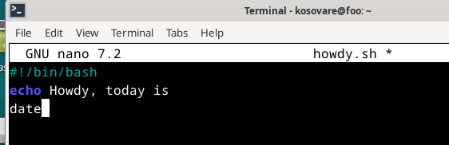

Tallensin tiedoston, palasin komentoriville ja ajoin komennon chmod +x howdy.sh. 

Sen jälkeen testasin, että se toimii suorittamalla komennon ./howdy.sh.

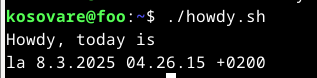

Komento toimi kuten odotin, joten jatkoin tehtävää. Seuraavaksi tein siitä kaikille käyttäjille suoritettavan komennolla sudo cp howdy.sh /usr/local/bin/howdy. Komentorivi pyysi salasanaa, jonka syötin. Lopuksi testasin komennon ajamalla komennon howdy.

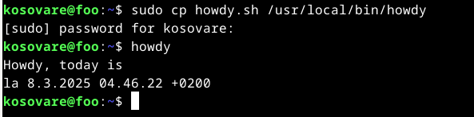

## e) 

Tehtävän suorituspäivä: 8.3.2025

Aloitin tehtävän luomalla uuden virtuaalikoneen ja suorittamalla tarvittavat alkumääritykset sekä päivitykset komentokehotteella. Päivitin järjestelmän ohjelmat komennolla sudo apt-get update ja sudo apt-get dist-upgrade. Asensin palomuurin komennolla sudo apt-get -y install ufw ja otin sen käyttöön komennolla sudo ufw enable. Lisäksi asensin nano-editorin tulevia tehtäviä varten komennolla sudo apt-get install nano.

Päivitysten ja asennusten jälkeen aloitin varsinaisen tehtävän asentamalla Apache-verkkopalvelimen komennolla sudo apt-get -y install apache2. Tämän jälkeen kirjoitin selaimen osoiteriville "http://localhost", ja pääsin Apachen aloitussivulle eli asennus oli onnistunut.

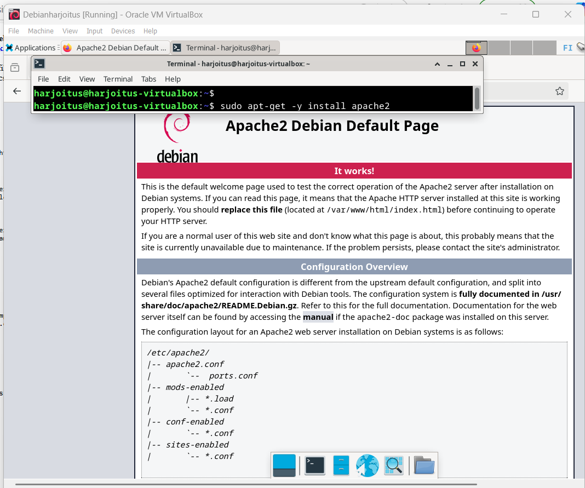

Muokkasin Apachen testisivua komennolla echo "AI Kakone" | sudo tee /var/www/html/index.html. Testasin muutosta avaamalla selaimessa "http://localhost", ja kirjoittamani teksti näkyi sivulla. 

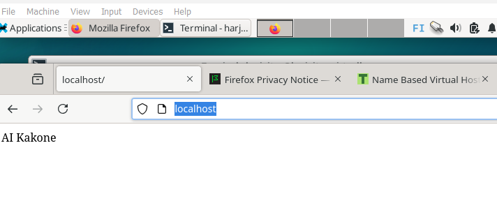

Seuraavaksi aloitin name-based virtual hostin luomisen. Ensin muokkasin Apache-verkkopalvelimen virtuaalipalvelimen asetuksia komennolla sudoedit /etc/apache2/sites-available/harjoitus.com.conf. Komento avasi nano-editorin, johon lisäsin seuraavan sisällön:

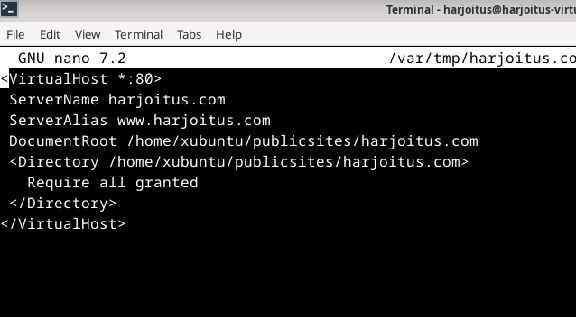

Tallennettuani konfiguraatiotiedoston palasin komentoriville ja otin muutokset käyttöön komennolla sudo a2ensite harjoitus.com sekä käynnistin Apachen uudelleen komennolla sudo systemctl restart apache2.

Seuraavaksi loin hakemiston sivustolle komennolla sudo mkdir -p /home/xubuntu/publicsites/harjoitus.com/ ja annoin kaikille käyttäjille luku- ja suoritusoikeudet komennolla sudo chmod ugo+rx /home/xubuntu/publicsites/harjoitus.com.

Tarkistin käynnissä olevat verkkosivut komennolla ls /etc/apache2/sites-enabled/ ja poistin oletussivun käytöstä komennolla sudo a2dissite 000-default.conf. Käynnistin Apachen uudelleen komennolla sudo systemctl restart apache2. Nyt vain itse luomani sivu (harjoitus.com) on käynnissä.

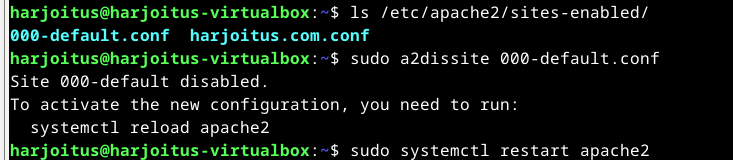

Jatkoin seuraavaksi luomalla html-tiedoston nano-editorissa komennolla nano /home/xubuntu/publicsites/harjoitus.com/index.html ja kirjoitin tiedostoon seuraavan sisällön:

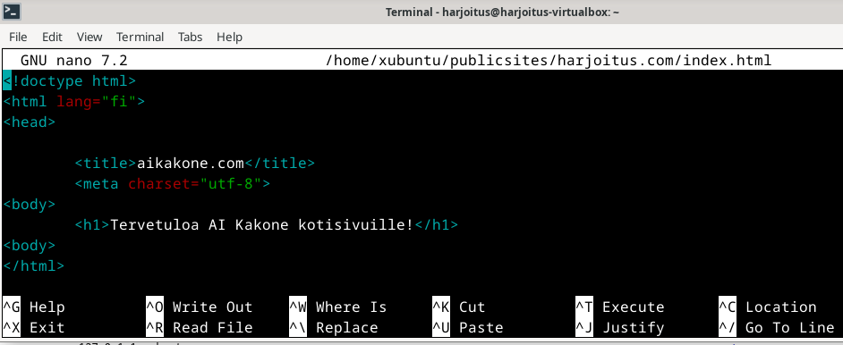

Tallensin tiedoston (Ctrl + S) ja poistun editorista. Tämän jälkeen päivitin verkkoselaimessa localhost-sivun ja tarkistin, että muutokset näkyvät sivulla. Sivu näytti oikealta. 

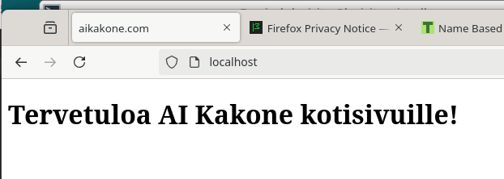

Lähteet: 

https://terokarvinen.com/2018/name-based-virtual-hosts-on-apache-multiple-websites-to-single-ip-address/?fromSearch=name%20based%20virtual%20hosts

https://terokarvinen.com/2024/arvioitava-laboratorioharjoitus-2024-linux-palvelimet/

## f)

Tehtävän suorituspäivä: 8.3.2025-9.3.2025.

Tässä harjoituksessa oli kolme osaa: ssh-palvelimen asennus, uuden käyttäjän luominen ja ssh-kirjautumisen automatisointi julkisen avaimen menetelmällä, niin että salasanan syöttämistä ei tarvita kirjautumisen yhteydessä.

Aloitin tehtävän päivittämällä paketit komennolla sudo apt-get update ja sallimalla tarvittavat yhteydet palomuurissa komennoilla sudo ufw allow 22/tcp, sudo ufw enable, sudo ufw allow 80/tcp ja sudo ufw enable.

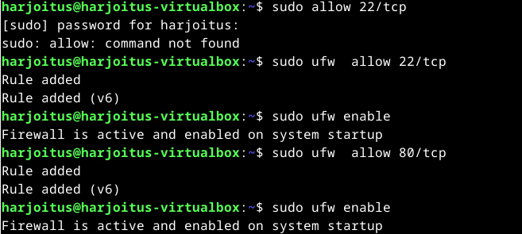

Seuraavaksi asensin ssh-palvelimen komennolla sudo apt-get -y install openssh-client. Tämän jälkeen loin ssh-avaimet komennolla ssh-keygen.

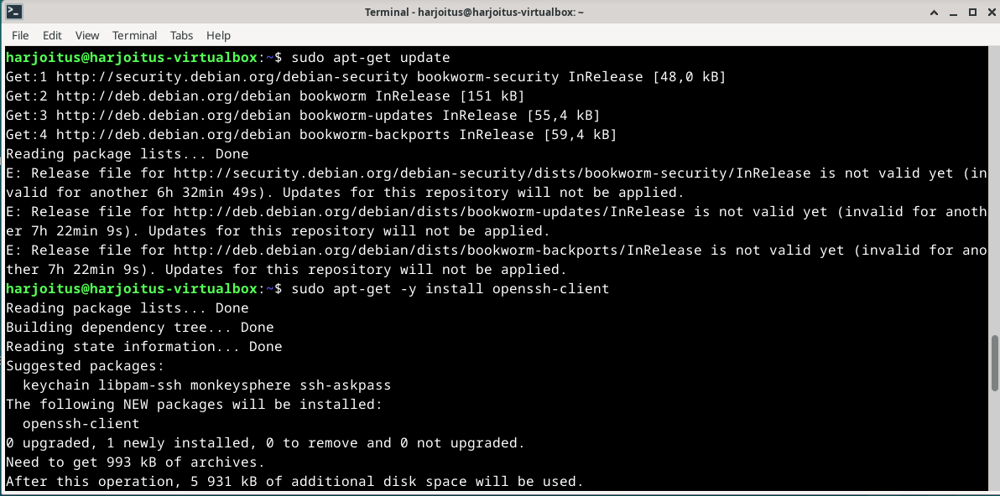

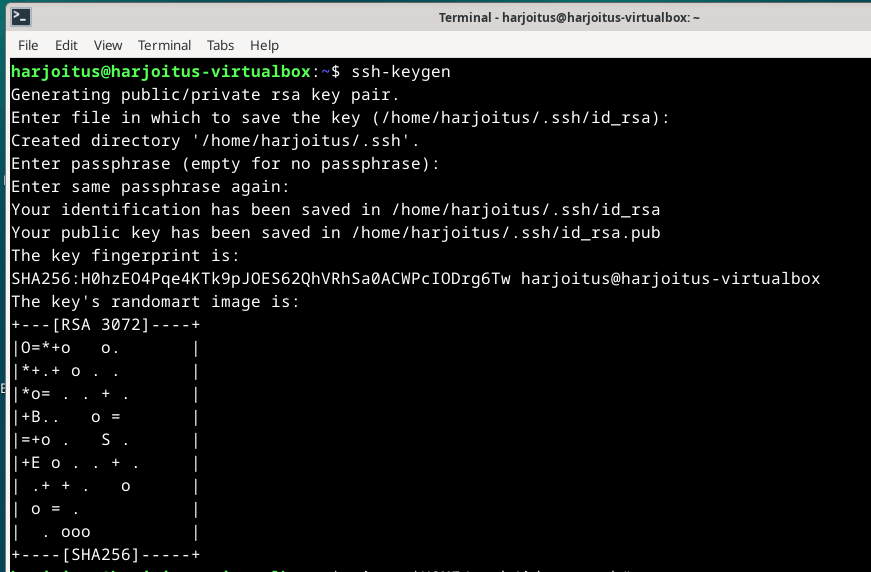

Tarkistin, että avaimet on luotu ja löytyvät kotihakemistosta komennolla cd /home/harjoitus/.ssh/ ja ls. Avaimet löytyivät, joten ensimmäinen osio oli valmis. 

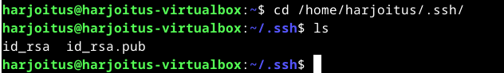

Tarkistin vielä, että ssh-yhteys on päällä ja toimii komennolla systemctl status ssh.

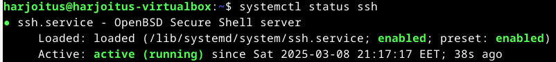

Seuraavaksi oli aika luoda uusi käyttäjä. Kirjauduin sisään ssh:lla komennolla ssh harjoitus@localhost.

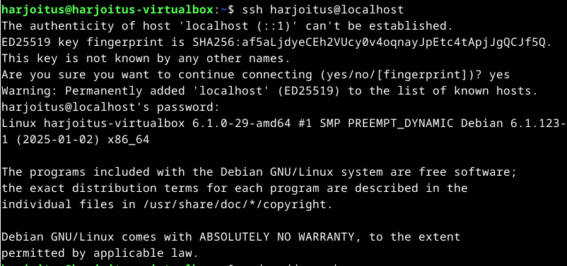

Loin uuden käyttäjän nimeltä "koso" komennolla sudo adduser koso. Vahvistin käyttäjän luomisen painamalla enteriä viisi kertaa ja syöttämällä "y" ja enter. Käyttäjä "koso" oli nyt luotu.

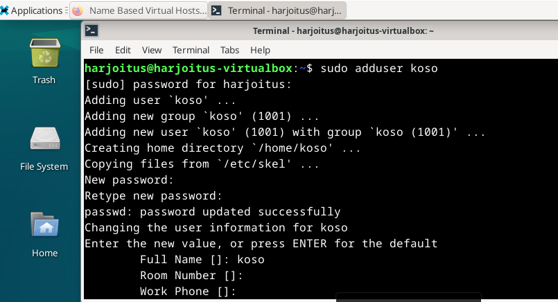

Seuraavaksi annoin käyttäjälle "koso" sudo-oikeudet komennolla sudo adduser koso sudo.

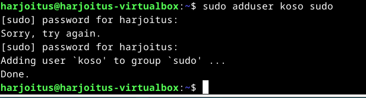

Kopioin root-käyttäjän ssh-asetukset, jotta voisin kirjautua sisään omalla käyttäjällä. Tein tämän komennoilla sudo cp -rvn /root/.ssh/ /home/koso/ ja sudo chown -R koso:koso /home/koso/.

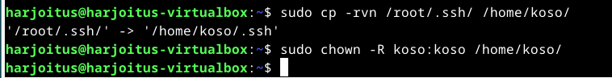

Tehtävän viimeisessä osiossa automatisoin käyttäjän koso ssh-kirjautumisen. Tehtävän toteuttamisessa hyödynsin useita eri lähteitä, jotka olen listannut lähdeluetteloon. Lisäksi minua kiinnosti, millaiset ohjeet ChatGPT antaisi tehtävän tekoon, joten kysyin siltä: "Automatisoi ssh-kirjautuminen julkisen avaimen menetelmällä, niin että et tarvitse salasanoja, kun kirjaudut sisään. Voit käyttää kirjautumiseen localhost-osoitetta". ChatGPT antoi muutamia hyödyllisiä vinkkejä, kuten nano-konfiguraatiotiedoston muokkaamiseen ja komennot tiedostojen ja hakemistojen käyttöoikeuksien muokkaamiseen. Päätin kuitenkin olla käyttämättä muita sen antamia ohjeita, koska ne tuntuivat minulle vierailta ja epäselviltä. 

Aloitin muokkaamalla ssh-konfiguraatiotiedostoa. Pääsin tiedostoon komennolla sudo nano /etc/ssh/sshd_config ja tarkistin, että tiedostosta löytyy kohta, jossa lukee "PubkeyAuthentication yes" sekä kohta, jossa lukee "PasswordAuthentication no". PasswordAuthentication -kohdassa luki "yes", joten muutin sen "no". Tallensin tiedoston muutoksen jälkeen ja siirryin takaisin komentoriville. (ChatGPT)

Yritin käynnistää ssh-palvelimen uudelleen, mutta se epäonnistui. Tarkistin komennolla ls -l ~/.ssh/, löytyvätkö aiemmin generoimani avaimet, mutta niitä ei ollut. En lähtenyt selvittämään asiaa sen tarkemmin, vaan loin uudet avaimet komennolla ssh-keygen.

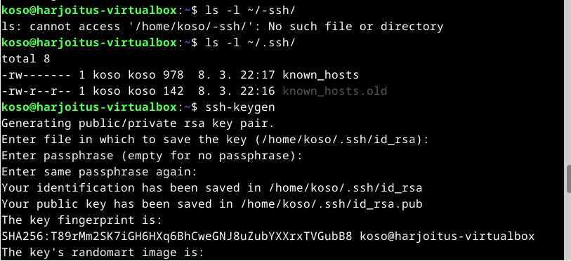

Tarkistin, että avaimet löytyvät komennolla ls -l ~/.ssh/. Avaimet löytyivät, jippii! 

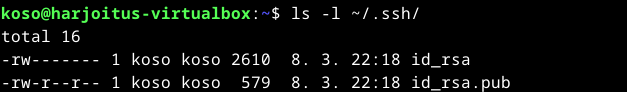

Seuraavaksi siirsin komennolla cat ~/.ssh/id_rsa.pub >> ~/ssh/authorized_keys julkisen avaimen tiedoston sisällön authorized_keys-tiedostoon. Tämän jälkeen muokkasin tiedostojen ja hakemistojen käyttöoikeudet niin, että käyttäjällä koso on pääsy tärkeisiin ssh-tiedostoihin ja hakemistoihin. Tein tämän komennoilla chmod 700 ~/.ssh ja chmod 600 ~/.ssh/authorized_keys (ChatGPT).

Käynnistin ssh-palvelimen uudelleen ja kirjauduin käyttäjällä "koso". Kirjautuminen tapahtui automaattisesti ssh-avaimen avulla, eikä salasanaa tarvinnut syöttää. 

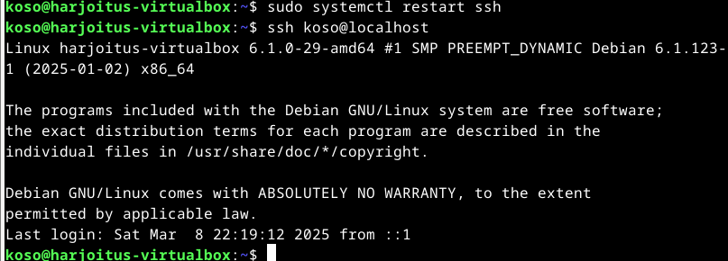

Lähteet: 

https://terokarvinen.com/2017/first-steps-on-a-new-virtual-private-server-an-example-on-digitalocean/

https://terokarvinen.com/linux-palvelimet/#h4-maailmakuulee

https://terokarvinen.com/oldsite/add_ssh_public_key_account.html?fromSearch=ssh

https://terokarvinen.com/linux-palvelimet/#h7-maalisuora
