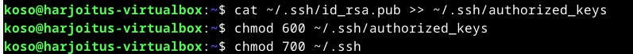

# H7 - Maalisuora

## a)

Tässä harjoituksessa tarkoituksena oli kirjoittaa ja suorittaa "Hei maailma" -ohjelma kolmella eri ohjelmointikielellä. Valitsin kieliksi Bashin, Pythonin ja

### Bash

Aloitin Bashilla. Ensin loin uuden skriptitiedoston nano-editorilla komennolla nano myscript.sh. 

Tiedoston ensimmäiselle riville lisäsin shebang-rivin #!/bin/bash, joka kertoo, että skripti suoritetaan bashilla. Seuraavaksi kirjoitin tiedostoon rivit echo Hei maailma ja date, jotka tulostavat "Hei maailma" ja näyttävät nykyisen päivämäärän ja ajan. Tallensin tiedoston painamalla Ctrl + X, minkä jälkeen editorin alareunaan tuli kysymys "Save modified buffer?". Kirjoitin "y", ja tiedosto tallentui.

Lopuksi tein skriptistä suoritettavan komennolla chmod +x myscript.sh. Tämän jälkeen ajoin skriptin komennolla ./myscript.sh.

### Python

Aloitin harjoituksen päivittämällä järjestelmän ohjelmistot ja asentamalla saatavilla olevat päivitykset komennoilla sudo apt update ja sudo apt upgrade. Seuraavaksi asensin Pythonin komennolla sudo apt install python3.

Testasin, että Python toimii komennolla python3 --version, joka palautti Pythonin versionumeron, mikä vahvistaa, että se on asennettu ja toimii oikein.

Loin uuden python-tiedoston komennolla nano hello.py. Siirryin nano-editoriin ja kirjoitin seuraavan sisällön:

Tallensin tiedoston, palasin komentoriville ja suoritin juuri luomani komennon komennolla python3 hello.py.

### Ruby

Aloitin tämänkin harjoituksen ensin asentamalla uuden ohjelmointikielen Ruby komennolla sudo apt install ruby. Seuraavaksi loin ruby-tiedoston nano-editorilla komennolla nano hello.rb. Siirryin nano-editoriin ja kirjoitin tiedostoon seuraavan sisällön: 

Tallensin tiedoston ja palasin komentoriville, jossa suoritin komennon chmod +x hello.rb, joka teki tiedostosta suoritettavan. Tämän jälkeen ajoin komennon ./hello.rb, ja ohjelma tulosti "Hei maailma".

Lähteet:

https://www.geeksforgeeks.org/custom-commands-linux-terminal/

https://www.geeksforgeeks.org/how-to-install-python-on-linux/

https://www.jcchouinard.com/create-python-script-from-terminal/

https://stackify.com/install-ruby-on-ubuntu-everything-you-need-to-get-going/#:~:text=Install%20Ruby%20on%20Ubuntu%20with%20APT%201%20Step,step%20is%20mostly%20for%20our%20own%20edification.%20

https://flatironschool.com/blog/building-your-first-command-line-application-in-ruby/

## c) Komento kaikille käyttäjille

Tässä harjoituksessa tavoitteena oli luoda uusi komento Linuxiin siten, että kaikki käyttäjät voivat käyttää sitä. Toteutin tämän aiemmin luomastani Bash-skriptistä (myscript.sh).

Kopioin skriptin järjestelmän hakemistoon komennolla sudo cp myscript.sh /usr/local/bin/myscript.

Lopuksi testasin komennon toimivuuden. Suoritin komennon myscript, ja se tulosti odotetusti "Hei maailma" sekä nykyisen päivämäärän.

Lähteet: 

https://terokarvinen.com/2007/12/04/shell-scripting-4/

## d) Vanha laboratorioharjoitus

Tässä harjoituksessa ratkaisin vanhan laboratorioharjoituksen soveltuvin osin. Valitsin vuoden 2024 kevään kurssin laboratorioharjoituksen. Tein tehtävän d kurssilla käyttämälläni virtuaalikoneella. Seuraavia harjoituksia varten loin uuden virtuaalikoneen harjoitusta varten H1 - oma Linux -harjoituksen ohjeiden mukaisesti.  

### d) Howdy

Aloitin tehtävän luomalla nano-tiedosto "howdy.sh". Luotuani tiedoston kirjoitin siihen seuraavan sisällön: 

Tallensin tiedoston, palasin komentoriville ja tein siitä suoritettavan komennolla chmod +x howdy.sh. 

Sen jälkeen testasin skriptin toimivuuden suorittamalla komennon ./howdy.sh.

Komento toimi kuten odotin, joten jatkoin tehtävää. Seuraavaksi tein siitä kaikkien käyttäjien käytettävissä olevan suorittamalla komennon sudo cp howdy.sh /usr/local/bin/howdy. Komentorivi pyysi salasanaa, jonka syötin. Lopuksi testasin komennon ajamalla komennon howdy.

## e) 

Aloitin tehtävän luomalla uuden virtuaalikoneen ja suorittamalla tarvittavat alkumääritykset sekä päivitykset komentokehotteella. Päivitin järjestelmän ohjelmat komennolla sudo apt-get update ja sudo apt-get dist-upgrade. Asensin palomuurin komennolla sudo apt-get -y install ufw ja otin sen käyttöön komennolla sudo ufw enable. Lisäksi asensin nano-editorin tulevia tehtäviä varten komennolla sudo apt-get install nano.

Päivitysten ja asennusten jälkeen aloitin varsinaisen tehtävän asentamalla Apache-verkkopalvelimen komennolla sudo apt-get -y install apache2. Tämän jälkeen kirjoitin selaimen osoiteriville "http://localhost", ja pääsin Apachen aloitussivulle eli asennus oli onnistunut.

Muokkasin Apachen testisivua komennolla echo "AI Kakone" | sudo tee /var/www/html/index.html. Testasin muutosta avaamalla selaimessa "http://localhost", ja kirjoittamani teksti näkyi odotetusti.

Seuraavaksi aloitin name-based virtual hostin luomisen. Ensin muokkasin Apache-verkkopalvelimen virtuaalipalvelimen asetuksia komennolla sudoedit /etc/apache2/sites-available/harjoitus.com.conf. Komento avasi nano-editorin, johon lisäsin seuraavan sisällön:

Tallennettuani konfiguraatiotiedoston palasin komentoriville ja otin muutokset käyttöön komennolla sudo a2ensite harjoitus.com sekä käynnistin Apachen uudelleen komennolla sudo systemctl restart apache2.

Seuraavaksi loin hakemiston sivustolle komennolla sudo mkdir -p /home/xubuntu/publicsites/harjoitus.com/ ja annoin kaikille käyttäjille luku- ja suoritusoikeudet komennolla sudo chmod ugo+rx /home/xubuntu/publicsites/harjoitus.com.

Tarkistin käynnissä olevat verkkosivut komennolla ls /etc/apache2/sites-enabled/ ja poistin oletussivun käytöstä komennolla sudo a2dissite 000-default.conf. Käynnistin Apachen uudelleen komennolla sudo systemctl restart apache2. Nyt vain itse luomani sivu (harjoitus.com) on käynnissä.

Jatkoin seuraavaksi luomalla html-tiedoston nano-editorissa komennolla nano /home/xubuntu/publicsites/harjoitus.com/index.html ja kirjoitin tiedostoon seuraavan sisällön:

Tallensin tiedoston (Ctrl + S) ja poistun editorista. Tämän jälkeen päivitin verkkoselaimessa localhost-sivun ja tarkistin, että muutokset näkyvät sivulla. Sivu näytti oikealta. 

Lähteet: 

https://terokarvinen.com/2018/name-based-virtual-hosts-on-apache-multiple-websites-to-single-ip-address/?fromSearch=name%20based%20virtual%20hosts

https://terokarvinen.com/2024/arvioitava-laboratorioharjoitus-2024-linux-palvelimet/

## f)

Tässä harjoituksessa oli kolme osaa: ssh-palvelimen asennus, uuden käyttäjän luominen ja ssh-kirjautumisen automatisointi julkisen avaimen menetelmällä niin, että ei tarvitse salasanoja, kun kirjaudun sisään.

Aloitin tehtävän päivittämällä paketit komennolla sudo apt-get update ja tekemällä palomuuriin reiät komennoilla sudo ufw allow 22/tcp, sudo ufw enable, sudo ufw allow 80/tcp ja sudo ufw enable.

Tämän jälkeen asensin ssh-palvelimen komennolla sudo apt-get -y install openssh-client. Seuraavaksi loin julkisen ja yksityisen avaimen komennolla ssh-keygen.

Tarkistin, että avaimet löytyvät kotihakemistosta komennolla cd /home/harjoitus/.ssh/ ja ls. Avaimet löytyivät ja ensimmäinen osio on valmis. 

Tarkistin vielä, että ssh-yhteys on päällä ja toimii komennolla systemctl status ssh.

Seuraavaksi oli aika luoda uusi käyttäjä. Aloitin kirjautumalla ssh:n komennolla ssh harjoitus@localhost.

Loin käyttäjän koso komennolla sudo adduser koso ja klikkasin enter viisi kertaa ja syötin "y" ja enter. Käyttäjä koso on nyt lisätty.

Annoin uudelle käyttäjälle sudo-oikeudet komennolla sudo adduser koso sudo. 

Kopioin seuraavaksi root:n ssh-asetukset, jotta voin kirjautua omalla käyttäjällä komennoilla sudo cp -rvn /root/.ssh/ /home/koso/ ja sudo chown -R koso:koso /home/koso/

Tehtävän viimeisessä osiossa automatisoin käyttäjän koso ssh-kirjautumisen, jonka jälkeen en tarvitse salasanoja, kun kirjaudun sisään. Käytin tehtävän tekoon useaa eri lähdettä, jotka on listattu lähdeluetteloon. Lisäksi minua kiinnosti, millaiset ohjeet ChatGPT antaisi tehtävän tekoon, joten syötin sille kysymyksen "Automatisoi ssh-kirjautuminen julkisen avaimen menetelmällä, niin että et tarvitse salasanoja, kun kirjaudut sisään. Voit käyttää kirjautumiseen localhost-osoitetta". Sain ChatGPT:ltä muutaman hyvän vinkin (nano-konfiguraatiotiedoston muokkaaminen ja komennot tiedostojen ja hakemistojen käyttöoikeuksien muokkaamiseen), mutta en käyttänyt muita sen antamia ohjeita, koska sen ohjeet ja komennot oli minulle vieraita. 

Aloitin tämän osion muokkaamalla ssh-konfiguraatiotiedostoa. Pääsin tiedostoon komennolla sudo nano /etc/ssh/sshd_config ja tarkistin, että tiedostosta löytyy kohta, jossa lukee "PubkeyAuthentication yes" sekä kohta, jossa lukee "PasswordAuthentication no". PasswordAuthentication -kohdassa luki "yes", joten muutin sen "no". Tallensin tiedoston ja siirryin takaisin komentoriville. (ChatGPT)

Yritin käynnistää ssh-palvelimen uudelleen, mutta se ei onnistunut. Tarkistin komennolla ls -l ~/.ssh/ löytyvätkö aiemmin generoimani avaimet, eikä niitä löytynyt. En lähtenyt selvittämään asiaa sen tarkemmin, loin uudet avaimet komennolla ssh-keygen.

Tarkistin, että avaimet löytyvät komennolla ls -l ~/.ssh/. Avaimet löytyivät, jippii! 

Seuraavaksi siirsin komennolla cat ~/.ssh/id_rsa.pub >> ~/ssh/authorized_keys id_rsa.pub-tiedoston sisällön .ssh/authorized_keys-tiedostoon. Tämän jälkeen muokkasin tiedostojen ja hakemistojen käyttöoikeuksia niin, että vain minulla on pääsy tärkeisiin ssh-tiedostoihin ja hakemistoihin. Tein tämän komennoilla chmod 700 ~/.ssh ja chmod 600 ~/.ssh/authorized_keys (ChatGPT).

Käynnistin ssh-palvelimen uudelleen ja kirjauduin käyttäjällä "koso". Kirjautuminen tapahtui automaattisesti ssh-avaimen avulla ilman, että minun tarvitsi syöttää salasanaa.

Lähteet: 

https://terokarvinen.com/2017/first-steps-on-a-new-virtual-private-server-an-example-on-digitalocean/

https://terokarvinen.com/linux-palvelimet/#h4-maailmakuulee

https://terokarvinen.com/oldsite/add_ssh_public_key_account.html?fromSearch=ssh

https://terokarvinen.com/linux-palvelimet/#h7-maalisuora
