# H2 - Komentaja Pingviini

## x) Command Line Basics Revisited -tiivistelmä

Komentorivi on tietokoneen käyttöliittymä, jossa käyttäjä antaa tekstimuotoisia komentoja. Näillä komennoilla ohjataan tietokonetta suorittamaan haluttuja toimintoja. Seuraavaksi esitellään muutamia tärkeitä komentoja, joilla aloittaa komentorivin käytön: 

- pwd: tulostaa nykyisen hakemiston polun
- ls: listaa tietyssä hakemistossa olevat tiedostot 
- dc: vaihtaa hakemistoa 
- mkdir: luo uuden hakemiston
- rm: poistaa tiedoston
- man ls: tulostaa ohjesivun
- history: tulostaa komentohistorian

On tärkeää ymmärtää hakemistorakennetta, jotta komentokehotteen komentoja ja tulosteita osaa tulkita oikein:  

- / on juurihakemisto
- /home/ sisältää kotihakemiston
- /home/kosovare/ on käyttäjän "kosovare" henkilökohtainen kotihakemisto
- /etc/ sisältää järjestelmän asetustiedostot
- /media/ on tarkoitettu irrotettavaille tallennusvälineille (esim. USB)
- /var/log/ sisältää järjestelmän lokitiedostot 

Sudo-komento suorittaa järjestelmän toimintoja, jotka vaativat korkeampia oikeuksia, ja niitä voi käyttää vain sudo-oikeudet omaava käyttäjä.

  - sudo apt-get update: päivittää saatavilla olevien pakettien listan
  - sudo apt-get -y install nethack-console: asentaa ohjelmiston
  - sudo apt-get purge nethack: poistaa ohjelmiston ja sen asetukset

## a) Micro

Tässä harjoituksessa asensin micro-editorin komentorivillä käyttämällä komentoa sudo apt-get install micro.

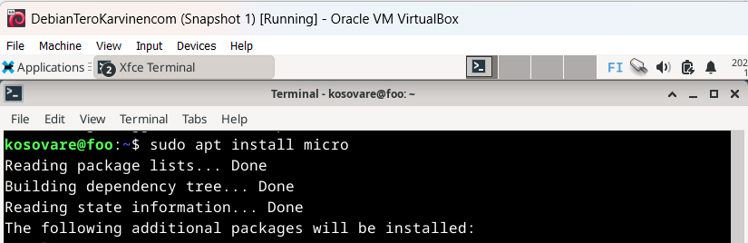

Asennuksen jälkeen testasin micro-editorin toimivuutta suorittamalla komennon micro --version.

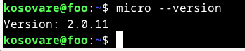

## b) Apt

Tässä harjoituksessa asensin kolme uutta ohjelmaa komentorivillä: htop, tree ja steam locomotive. Asensin ohjelmat yksitellen harjoitusta varten. Kaikki kolme ohjelmaa voidaan kuitenkin asentaa yhtä aikaa yhdellä komennolla. Tämä onnistuu seuraavasti:

sudo apt update
sudo apt install htop tree locomotive

#### Htop
Htop on tekstipohjainen prosessinhallintaohjelma, joka näyttää järjestelmän tilan tietoja ja mahdollistaa prosessien tarkastelun sekä hallinnan. Asensin htop-ohjelman komennolla sudo apt install htop.

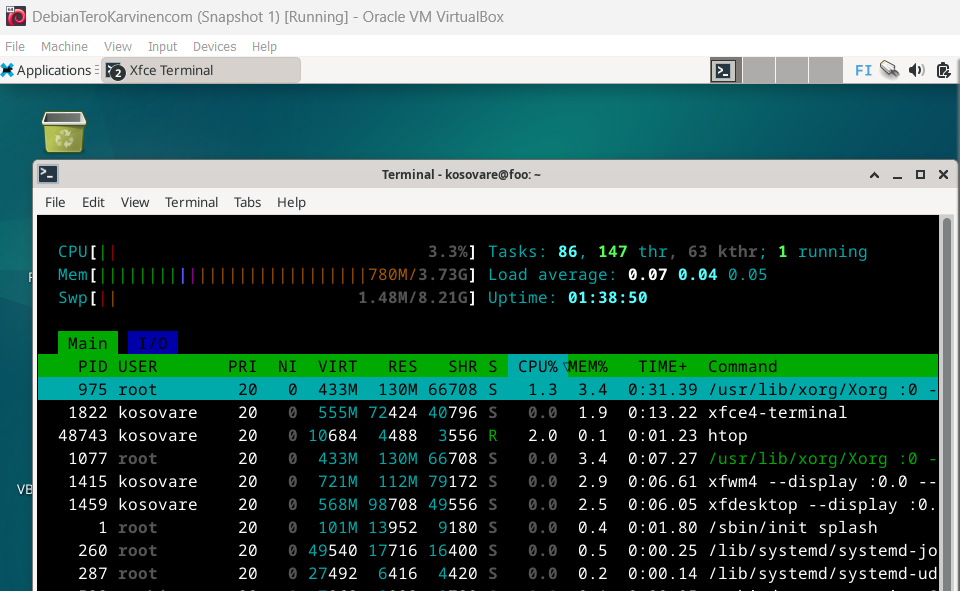

#### Tree
Tree on ohjelma, joka näyttää tiedostojen ja hakemistojen rakenteen puumaisena luettelona. Asensin tree-ohjelman komennolla sudo apt install tree.

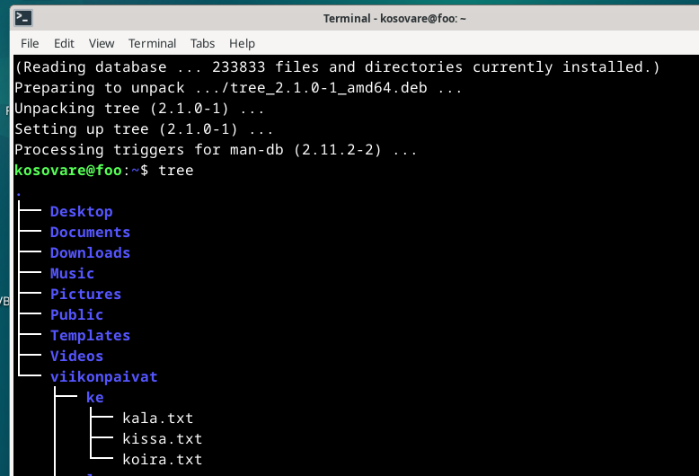

#### Steam locomotive
Steam locomotive on ohjelma, joka näyttää liikkuvan junan komentokehotteessa. Asensin sl-ohjelman komennolla sudo apt install steam locomotive.

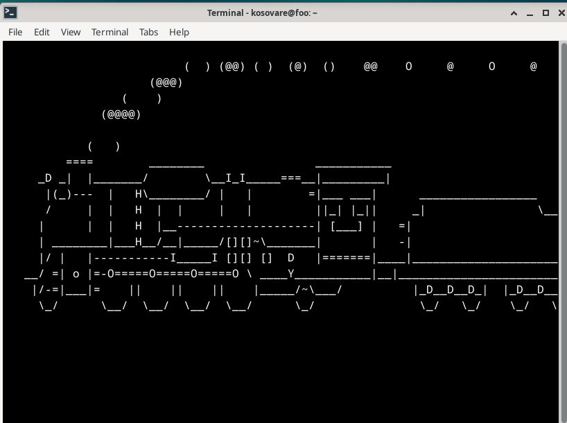

## c) FHS

Seuraavassa harjoituksessa tehtävänä oli esitellä tärkeät hakemistot, jotka olivat listattuina Command Line Basics Revisited -artikkelissa. 

#### Juurihakemisto
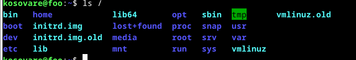

#### Kotihakemisto
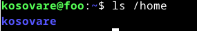

#### Käyttäjän "kosovare" hakemisto
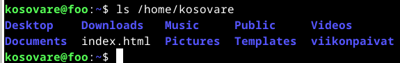

#### Järjestelmän asetukset
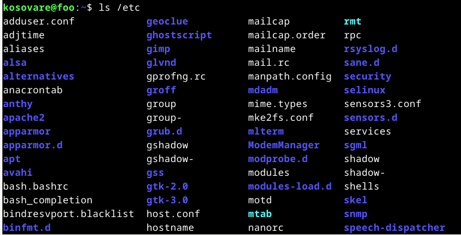

#### Ulkoiset tallennusvälineet (esim. USB)
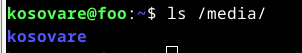

#### Järjestelmän lokitiedostot
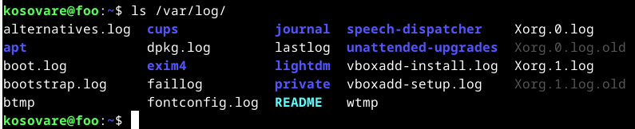

## d) The Friendly M

Tässä harjoituksessa testasin grep-komennon käyttöä kolmella eri tavalla. Grep (global regular expression search) on komento, joka mahdollistaa tiettyjen merkkijonojen etsimisen esimerkiksi tiedostoista.

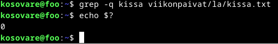
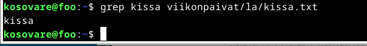
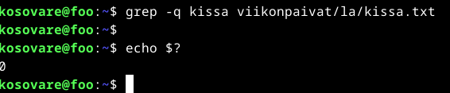

## e) Pipe

Putki (pipe) on tapa ohjata yhden komennon tuloste suoraan toisen komennon käsiteltäväksi. 

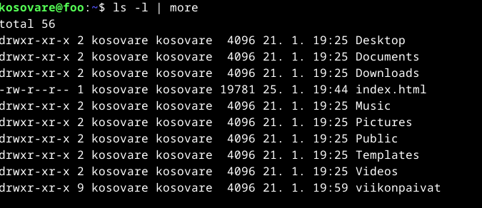

## f) Rauta

Lshw (list hardware) on komentorivillä käytettävä työkalu, joka näyttää listauksen järjestelmän laitteistosta (raudasta). Aloitin tämän tehtävän asentamalla lshw:n komentorivillä komennolla sudo apt-get install lshw. 

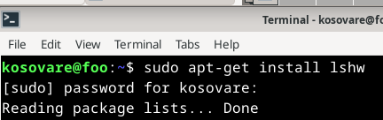

Asennuksen jälkeen suoritin komennon sudo lshw -short -sanitize, joka näytti koneeni laitteiston tiedot. Tehtävänä oli myös tulosteen analysointi. Laite toimii VirtualBox-virtuaaliympäristössä. Järjestelmässä on 4 GiB RAM ja 128 KiB BIOS-muistia. Prosessorina on AMD Ryzen 5 4600H. Koneeseen on liitetty CD-ROM-laite ja 21 GB VirtualBox-kovalevy, joka on jaettu kahteen osioon: /dev/sda1 (EXT4) ja /dev/sda2 (swap). Verkkokortti on 82540EM Gigabit Ethernet Controller ja äänikortti on 82801AA AC'97 Audio Controller. Laitteistossa on myös näppäimistö, hiiri, virtapainike ja USB-laitteiden hallinta.

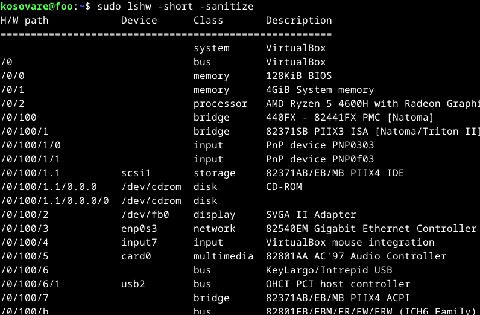

## Lähteet: 

How to use lshw in Linux (with practical example). Luettavissa: https://www.howtogeek.com/devops/how-to-use-lshw-in-linux-with-a-practical-example/. Luettu 27.1.2025.

Tree command in Linux with examples. Luettavissa: https://www.geeksforgeeks.org/tree-command-unixlinux/. Luettu 26.1.2025.

Bohn K. 10.2.2020. A Beginners Guide to htop for Process Management. Luettavissa: https://spin.atomicobject.com/htop-guide/. Luettu: 26.1.2025.

Piping in Unix or Linux. Luettavissa: https://www.geeksforgeeks.org/piping-in-unix-or-linux/. Luettu: 26.1.2025. 

McKay C. 10.9.2023. How to use the grep command on Linux. Luettavissa: https://www.howtogeek.com/496056/how-to-use-the-grep-command-on-linux/. Luettu 26.1.2025.

Gite V. 14.9.2023. How to install wget on a Debian or Ubuntu Linux.Luettavissa: 

How to install "tree" with command-line?. Luettavissa: https://askubuntu.com/questions/572093/how-to-install-tree-with-command-line. Luettu: 25.1.2025.

Gite V. 21.6.2024. How to install htop on Ubuntu Linux using apt. Luettavissa: https://www.cyberciti.biz/faq/how-to-install-htop-on-ubuntu-linux-using-apt/. Luettu 25.1.2025.

r00t. How To Install Micro Text Editor on Debian 12. Luettavissa: https://idroot.us/install-micro-text-editor-debian-12/. Luettu 25.1.2025.

Cocca G. 5.4.2022. Command Line for Beginners – How to Use the Terminal Like a Pro [Full Handbook]. Luettavissa: https://www.freecodecamp.org/news/command-line-for-beginners/. Luettu 25.1.2025.

Karvinen T. Comman line basics revisited. Luettavissa: https://terokarvinen.com/2020/command-line-basics-revisited/?fromSearch=command%20line%20basics%20revisited. Luettu 25.1.2025.

