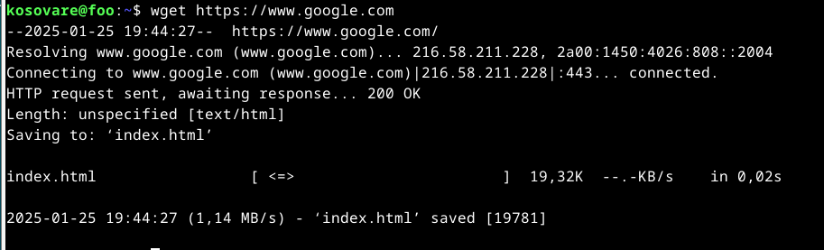
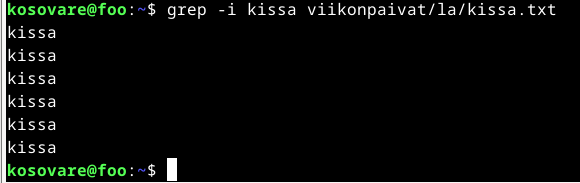

# H2 - Komentaja Pingviini

### x) Command Line Basics Revisited -tiivistelmä

Komentorivi on tietokoneen käyttöliittymä, jossa käyttäjä antaa tekstimuotoisia komentoja. Näillä komennoilla ohjataan tietokonetta suorittamaan haluttuja toimintoja. Seuraavaksi esitellään muutamia tärkeitä komentoja, joilla aloittaa komentorivin käytön: 

- pwd: tulostaa nykyisen hakemiston polun
- ls: listaa työhakemistossa olevat tiedostot 
- dc: vaihtaa hakemistoa 
- mkdir: luo uuden hakemiston
- rm: poistaa tiedoston
- man ls: tulostaa manuaalisivun
- history: tulostaa komentohistorian

On tärkeää ymmärtää hakemistorakennetta, jotta komentokehotteen komentoja ja tulosteita osaa tulkita oikein:  

- / on juurihakemisto
- /home/ sisältää kotihakemiston
- /home/kosovare/ on käyttäjän "kosovare" henkilökohtainen kotihakemisto
- /etc/ sisältää järjestelmän asetustiedostot
- /media/ on tarkoitettu irrotettavaille tallennusvälineille (esim. USB)
- /var/log/ sisältää järjestelmän lokitiedostot 

Sudo-komento suorittaa järjestelmän toimintoja, jotka vaativat korkeampia oikeuksia, ja niitä voi käyttää vain sudo-oikeudet omaava käyttäjä.

  - sudo apt-get update: päivittää pakettien saatavuuslistan
  - sudo apt-get -y install nethack-console: asentaa ohjelmiston
  - sudo apt-get purge nethack: poistaa ohjelmiston ja sen asetukset

### a) Micro

Tässä harjoituksessa asensin micro-editorin komentorivillä. 

### b) Apt

Tässä harjoituksessa asensin kolme ohjelmaa: htop, tree ja wget.

Htop:

Tree:

Wget:

Kaikki kolme ohjelmaa voi asentaa yhtä aikaa seuraavalla komennolla: 

- sudo apt-get install nano htop wget

### c) FHS

### d) The Friendly M

### e) Pipe

### f) Rauta

Lähteet: 
McKay C. 10.9.2023. How to use the grep command on Linux. Luettavissa: https://www.howtogeek.com/496056/how-to-use-the-grep-command-on-linux/. Luettu 26.1.2025.
Gite V. 14.9.2023. How to install wget on a Debian or Ubuntu Linux.Luettavissa: https://www.cyberciti.biz/faq/how-to-install-wget-togetrid-of-error-bash-wget-command-not-found/. Luettu 25.1.2025
How to install "tree" with command-line?. Luettavissa: https://askubuntu.com/questions/572093/how-to-install-tree-with-command-line. Luettu: 25.1.2025.
Gite V. 21.6.2024. How to install htop on Ubuntu Linux using apt. Luettavissa: https://www.cyberciti.biz/faq/how-to-install-htop-on-ubuntu-linux-using-apt/. Luettu 25.1.2025.
r00t. How To Install Micro Text Editor on Debian 12. Luettavissa: https://idroot.us/install-micro-text-editor-debian-12/. Luettu 25.1.2025.
Cocca G. 5.4.2022. Command Line for Beginners – How to Use the Terminal Like a Pro [Full Handbook]. Luettavissa: https://www.freecodecamp.org/news/command-line-for-beginners/. Luettu 25.1.2025.
