# H5 Nimekäs

### a) Nimi

Aloitin harjoituksen luomalla käyttäjätunnuksen Namecheapissä ja vuokraamalla domainin "kosovaredubova.online" vuodeksi. Prosessi oli selkeä, se onnistui helposti seuraamalla Namecheapin ohjeita.

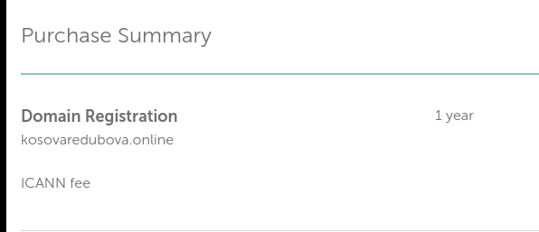

Nimen vuokraamisen jälkeen ohjasin domainin kosovaredubova.online DigitalOceanilta hankitulle virtuaalipalvelimelle. Tämä onnistui Namecheapin hallintapaneelin Advanced DNS -välilehdellä lisäämällä kaksi A-tietuetta, jotka osoittavat virtuaalipalvelimeni IP-osoitteeseen 94.237.11.122. Lopukso tallensin muutokset.

Lähteet: https://susannalehto.fi/2022/selainpohjainen-ohjelma-djangolla-h5/

### b) Based

Tässä tehtävässä asensin DigitalOceanilta hankitulle virtuaalikoneelle Apache-webpalvelimen, korvasin testisivun ja määritin käyttäjälleni "kosovare" oikeudet ylläpitää kotisivua  ilman pääkäyttäjän oikeuksia. 

Aloitin luomalla uuden käyttäjän komennolla sudo adduser kosovare. Tämän jälkeen lisäsin käyttäjän sudo-ryhmään komennolla sudo adduser kosovare sudo. Seuraavaksi testasin käyttäjätunnuksia avaamalla SSH-yhteyden virtuaalipalvelimeen komennolla ssh kosovare@94.237.11.122. Päivitin ohjelmat ajan tasalle komennolla sudo apt-get update. Lukitsin root-käyttäjän komennolla sudo usermod --lock root. 

Seuraavaksi asensin virtuaalipalvelimelle päivitykset komennolla sudo apt-get update,  sudo apt-get upgrade ja sudo apt-get dist-upgrade. Tämän jälkeen asensin Apache-webpalvelimen komennolla $ sudo apt-get install apache2, ja tarkistin, että se on käynnissä ja toimii komennolla sudo systemctl status apache2. 

Lisäsin vielä palomuurin sääntöjä avatakseni tarvittavan portin komennoilla sudo ufw allow 80/tcp ja sudo ufw allow 80/tcp. Kun testasin selaimessa, Apachen testisivu oli näkyvissä. 

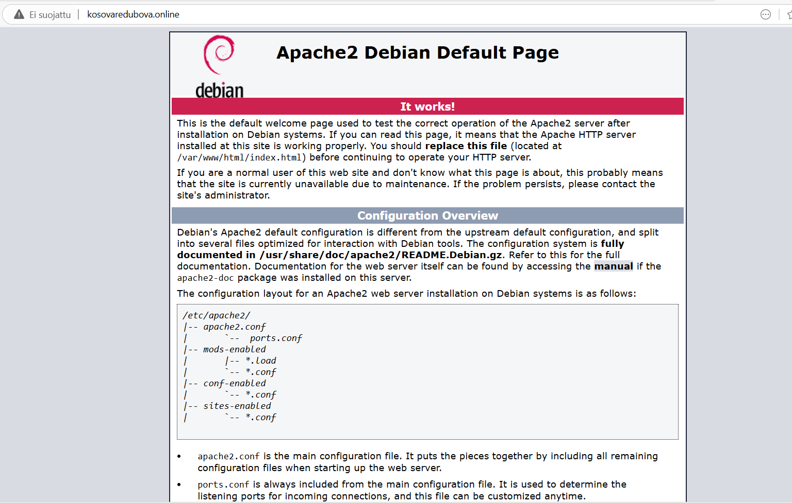

Seuraavaksi korvasin testisivun "Kosovaren!" -viestillä komennolla  echo "Kosovaren sivut!" | sudo tee /var/www/html/index.html.

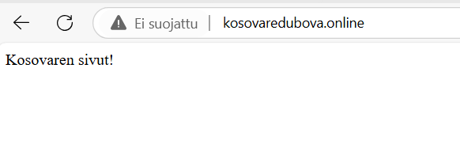

Lopuksi otin käyttöön userdir-moduulin komennolla sudo a2enmod userdir, jotta käyttäjä voisi luoda ja ylläpitää kotisivujaan ilman pääkäyttäjän oikeuksia ja käynnistin apachen komennolla  sudo service apache2 restart.

Lähteet: https://susannalehto.fi/2022/teoriasta-kaytantoon-pilvipalvelimen-avulla-h4/

c)

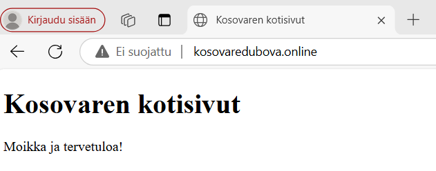
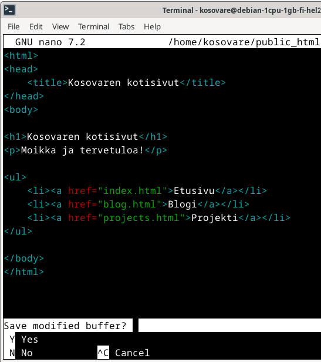
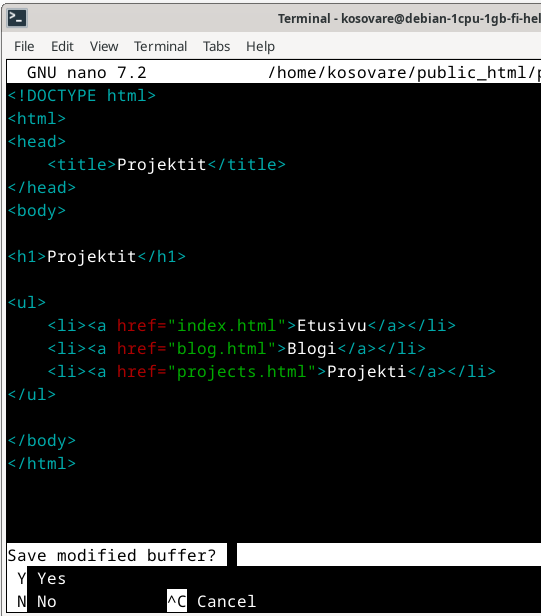
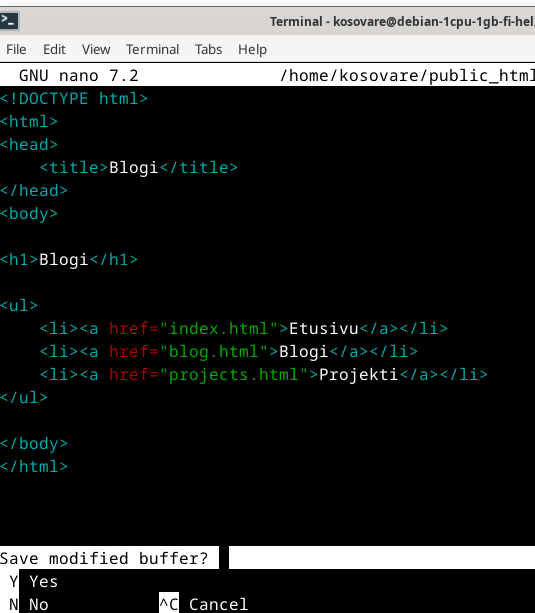
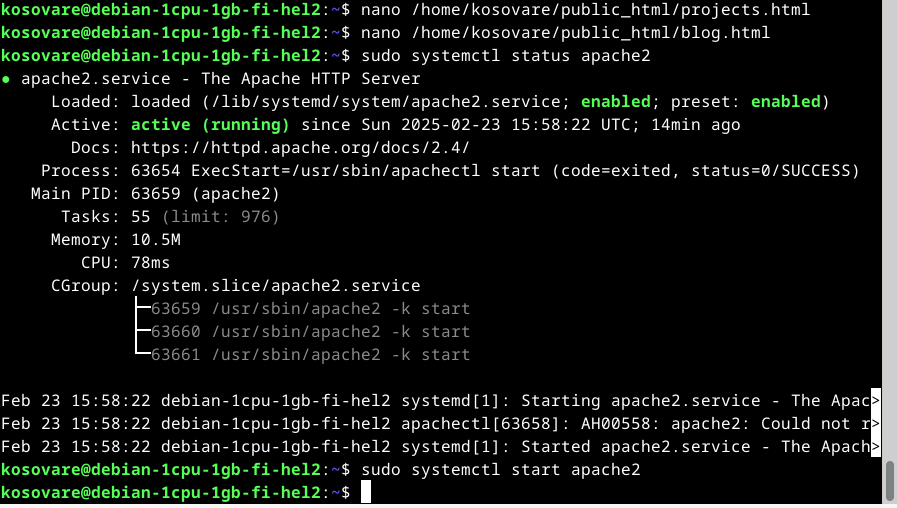
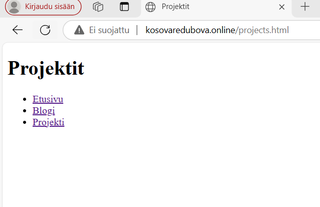

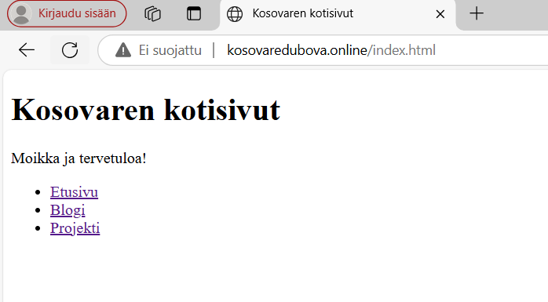

d)

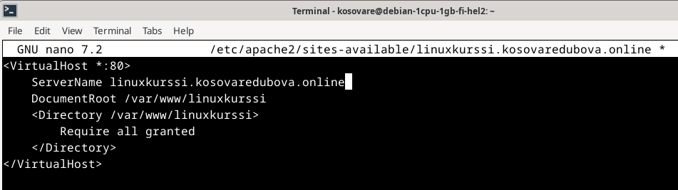
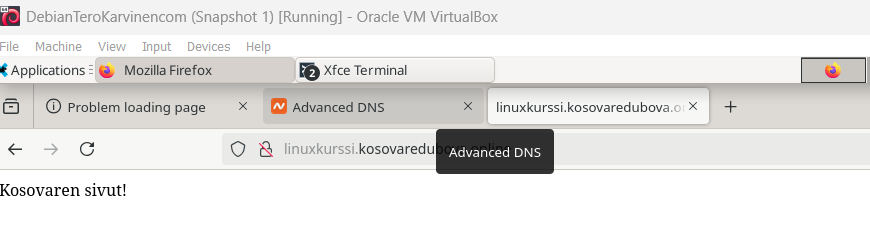
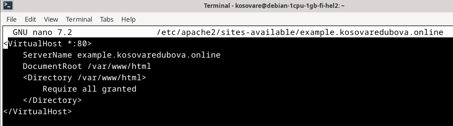

### e) Host ja dig -komennot

Tässä tehtävässä oli tarkoituksena harjoitella "dig" ja "host" -komentojen käyttöä domainien dns-tietojen tutkimiseen sekä vertailla niiden tuottamia tuloksia. 

Aloitin tehtävän asentamalla ja päivittämällä dnsutils-paketin komennolla sudo apt install dnsutils -y. Seuraavaksi käytin komentoa host kosovaredubova.online saadakseni tietoja domainini DNS-asetuksista. Komento palautti ensin IP-osoitteen 94.237.11.122, johon domain kosovaredubova.online ohjaa. Lisäksi selvisi, että domainillani on useita sähköpostipalvelimia, joista ensisijainen on eforward1.registrar-servers.com. Seuraavaksi käytin komentoa dig kosovaredubova.online, joka palautti domainin ip-osoitteen, kyselyajan (52 millisekuntia), käytetyn dns-palvelimen (94.237.127.9) sekä EDNS-tiedot, sekä edns-tiedon, joka kertoo dns:n käyttävän versiota 0.

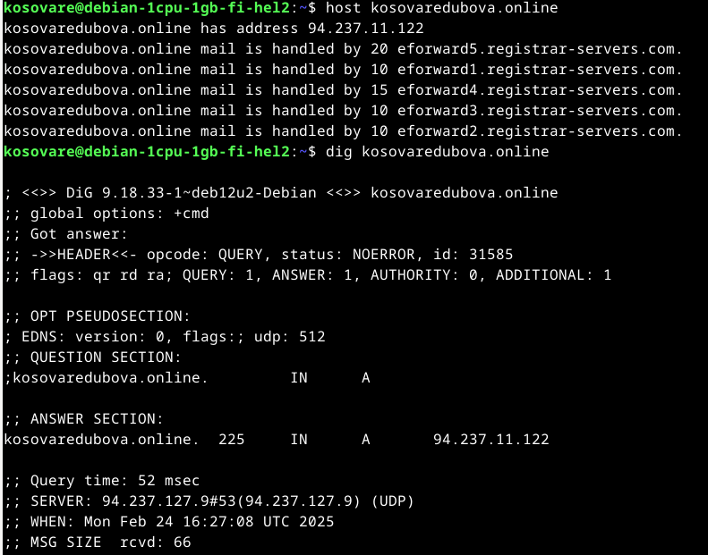

Seuraavaksi hain komennoilla host ja dig domainin terokarvinen.com DNS-tietoja. Host-komennolla sain selville, että domainin ip-osoite on 139.162.131.217 ja sähköpostin käsittelyyn käytettävä palvelin on mx.runbox.com. Dig-komento palautti saman ip-osoitteen, kyselyajan (4 millisekuntia), käytetyn dns-palvelimen osoitteen (94.237.127.9) sekä edns-tiedon, joka kertoo dns:n käyttävän versiota 0.

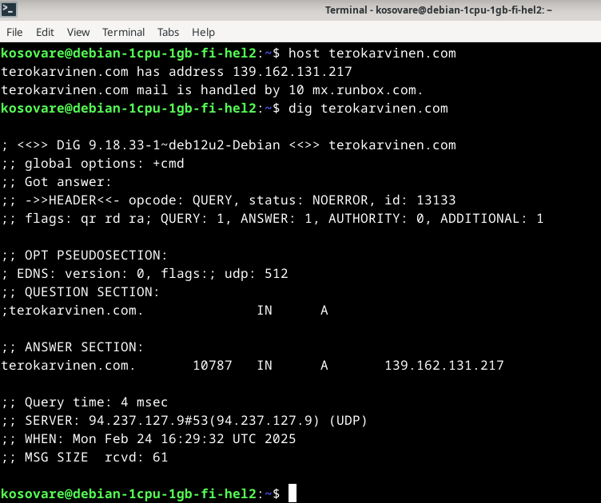

Lopuksi käytin host ja dig -komentoja google.com dns-tietojen tutkimiseen. Host palautti domainin IPv4-osoitteen 172.217.23.206 ja IPv6-osoitteen 2a00:1450:400e:805::200e sekä tiedon, että domainin sähköpostipalvelimet käsittelevät sähköpostiliikennettä (ensisijainen palvelin on smtp.google.com). Dig palautti saman IPv4-osoitteen, kyselyajan (4 millisekuntia), käytetyn dns-palvelimen osoitteen (94.237.127.9) sekä edns-tiedon, joka kertoo dns:n käyttävän versiota 0.

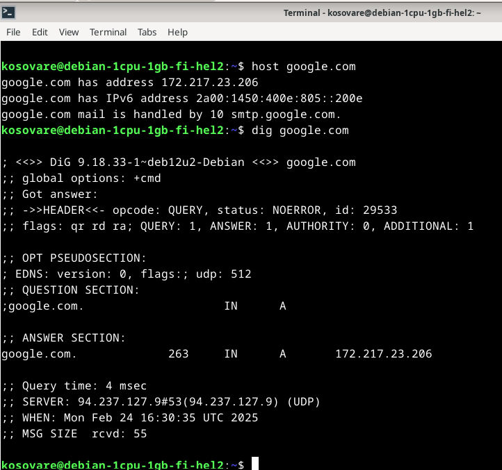

Lähteet: https://susannalehto.fi/2022/selainpohjainen-ohjelma-djangolla-h5/
https://stackoverflow.com/questions/17898026/how-to-use-href-attribute-in-lists-ol-ul-using-html5
https://www.w3schools.com/html/html_basic.asp
