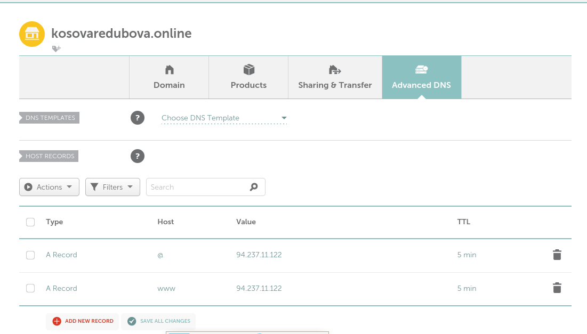

# H5 Nimekäs

a) Nimi

Aloitin tämän harjoituksen hankkimalla domainin "kosovaredubova.online" Namecheapistä.

Seuraavaksi siirryin "Advanced DNS" -välilehdelle ja lisäsin kaksi A-tietuetta, joiden avulla ohjasin domainin kosovaredubova.online osoittamaan virtuaalipalvelimeni IP-osoitteeseen 94.237.11.122.

b) Based

