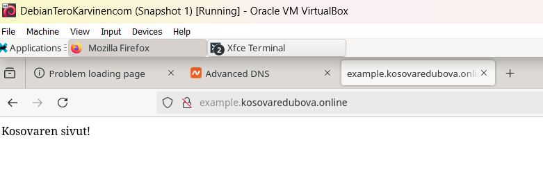

# H5 Nimekäs

a) Nimi

Aloitin tämän harjoituksen hankkimalla domainin "kosovaredubova.online" Namecheapistä.

Seuraavaksi siirryin "Advanced DNS" -välilehdelle ja lisäsin kaksi A-tietuetta, joiden avulla ohjasin domainin kosovaredubova.online osoittamaan virtuaalipalvelimeni IP-osoitteeseen 94.237.11.122.

Lähteet: https://susannalehto.fi/2022/selainpohjainen-ohjelma-djangolla-h5/

b) Based

Lähteet: https://susannalehto.fi/2022/selainpohjainen-ohjelma-djangolla-h5/

c)

d)

### e) Host ja dig -komennot

Tässä tehtävässä oli tarkoituksena harjoitella "dig" ja "host" -komentojen käyttöä domainien dns-tietojen tutkimiseen sekä vertailla niiden tuottamia tuloksia. 

Aloitin tehtävän asentamalla ja päivittämällä dnsutils-paketin komennolla sudo apt install dnsutils -y. Seuraavaksi käytin komentoa host kosovaredubova.online saadakseni tietoja domainini DNS-asetuksista. Komento palautti ensin IP-osoitteen 94.237.11.122, johon domain kosovaredubova.online ohjaa. Lisäksi selvisi, että domainillani on useita sähköpostipalvelimia, joista ensisijainen on eforward1.registrar-servers.com. Seuraavaksi käytin komentoa dig kosovaredubova.online, joka palautti domainin ip-osoitteen, kyselyajan (52 millisekuntia), käytetyn dns-palvelimen (94.237.127.9) sekä EDNS-tiedot, sekä edns-tiedon, joka kertoo dns:n käyttävän versiota 0.

Seuraavaksi hain komennoilla host ja dig domainin terokarvinen.com DNS-tietoja. Host-komennolla sain selville, että domainin ip-osoite on 139.162.131.217 ja sähköpostin käsittelyyn käytettävä palvelin on mx.runbox.com. Dig-komento palautti saman ip-osoitteen, kyselyajan (4 millisekuntia), käytetyn dns-palvelimen osoitteen (94.237.127.9) sekä edns-tiedon, joka kertoo dns:n käyttävän versiota 0.

Lopuksi käytin host ja dig -komentoja google.com dns-tietojen tutkimiseen. Host palautti domainin IPv4-osoitteen 172.217.23.206 ja IPv6-osoitteen 2a00:1450:400e:805::200e sekä tiedon, että domainin sähköpostipalvelimet käsittelevät sähköpostiliikennettä (ensisijainen palvelin on smtp.google.com). Dig palautti saman IPv4-osoitteen, kyselyajan (4 millisekuntia), käytetyn dns-palvelimen osoitteen (94.237.127.9) sekä edns-tiedon, joka kertoo dns:n käyttävän versiota 0.

Lähteet: https://susannalehto.fi/2022/selainpohjainen-ohjelma-djangolla-h5/
https://stackoverflow.com/questions/17898026/how-to-use-href-attribute-in-lists-ol-ul-using-html5
https://www.w3schools.com/html/html_basic.asp
