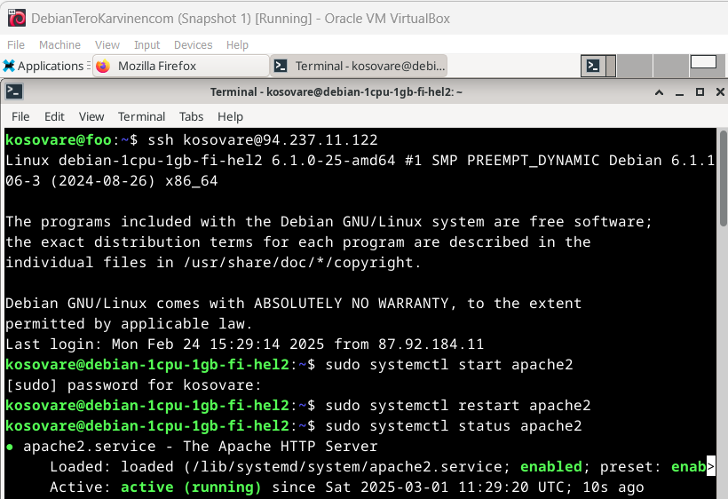
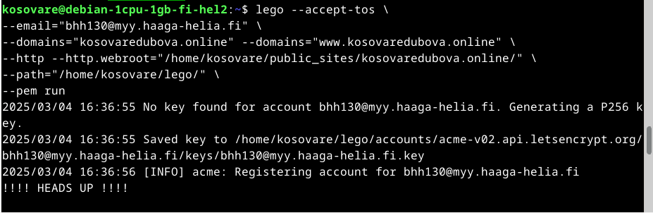

# H6 - Salataampa

## x)

### Lets encrypt

Let's Encrypt ja ACME-protokolla mahdollistavat HTTPS-palvelimen ja selainluotetun varmenteen automaattisen käyttöönoton ilman ihmisen väliintuloa. Prosessi etenee seuraavasti:

1. Let's Encrypt tunnistaa palvelimen ylläpitäjän julkisen avaimen avulla. Ensimmäisellä käyttökerralla agenttiohjelma luo avainparin ja todistaa varmenteen myöntävälle taholle (CA), että palvelin hallitsee domainia.

2. CA antaa agentille haasteen domainin hallinnan varmistamiseksi. Haaste voi olla esimerkiksi tietyn DNS-tietueen lisääminen domainin alle. Samalla CA toimittaa agentille merkkijonon (nonce), joka on allekirjoitettava yksityisellä avaimella avainparin hallinnan varmistamiseksi.

3. Kun agentti on suorittanut haasteen CA tarkistaa annetut tiedot, ja jos kaikki on oikein, se myöntää agentille oikeuden hallita domainiin liittyviä varmenteita.

Kun agentti on valtuutettu, varmenteiden pyytäminen, uusiminen ja peruuttaminen on yksinkertaista: oikea pyyntö lähetetään CA:lle ja agentti allekirjoittaa sen valtuutetulla avaimella.

Lähde: https://letsencrypt.org/how-it-works/

### Using an existing, running web server

Jos sinulla on jo verkkosivusto, joka toimii portissa 80, käytä --http ja --http.webroot -asetuksia. Näin ohjelma tallentaa haasteen tiedoston .well-known/acme-challenge -hakemistoon ilman, että palvelinta käynnistetään. Hakemiston täytyy olla julkisesti näkyvissä verkkosivulla. Jos se ei ole, pyynnöt voi ohjata oikeaan hakemistoon komennolla lego --accept-tos --email you@example.com --http --http.webroot /path/to/webroot --domains example.com run.

Lähde: https://go-acme.github.io/lego/usage/cli/obtain-a-certificate/index.html#using-an-existing-running-web-server

### Basic Configuration Example

Esimerkki peruskonfiguraatiosta:

LoadModule ssl_module modules/mod_ssl.so

Listen 443

Lähde: https://httpd.apache.org/docs/2.4/ssl/ssl_howto.html#configexample

## a) Let's
 
Tässä tehtävässä tavoitteena oli hankkia ja asentaa ilmainen TLS-sertifikaatti Let's Encryptilta palvelimelleni sekä varmistaa sen toimivuus. Aluksi varmistin, että verkkosivuni toimii, ja käynnistin tarvittavat palvelut.

Potkaisin demonia seuraavilla komennoilla: 

Verkkosivut toimivat odotetusti:

Jatkoin tehtävää asentamalla Legon komennolla sudo apt-get install lego, ja loin lego-hakemiston komennolla mkdir lego. 

Seuraavaksi loin testisertifikaatin testipalvelimella seuraavalla komennolla:

lego --server=https://acme-staging-v02.api.letsencrypt.org/directory \
--accept-tos \
--email="bhh130@myy.haaga-helia.fi" \
--domains="kosovaredubova.online" --domains="www.kosovaredubova.online" \
--http --http.webroot="/home/kosovare/public_sites/kosovaredubova.online/" \
--path="~/.lego" \
--pem run

Seuraavassa kohdassa otin käyttöön salauksen omalle sivustolleni (kosovaredubova.online). Aloitin nimeämällä aiemmin luomani lego-kansion uudelleen nimellä old-lego ja loin uuden lego-kansion.

Uuteen kansioon tallensin verkkosivuni Let's Encryptin SSL-sertifikaatit. Loin sertifikaatit ajamalla seuraavan komennon:

lego --accept-tos \
--email="bhh130@myy.haaga-helia.fi" \
--domains="kosovaredubova.online" --domains="www.kosovaredubova.online" \
--http --http.webroot="/home/kosovare/public_sites/kosovaredubova.online/" \
--path="/home/kosovare/lego/" \
--pem run
 

Sertifikaattien luomisen jälkeen otin käyttöön Apache-palvelimen SSL-moduulin komennolla sudo a2enmod ssl, ja käynnistin Apachen uudelleen komennolla sudo systemctl restart apache2.

Jatkoin tehtävää muokkaamalla kosovaredubova.online.conf-tiedostoa. Siirryin tiedoston muokkaustilaan komennolla sudo nano /etc/apache2/sites-available/kosovaredubova.online.conf ja lisäsin seuraavat tiedot:

Palasin komentoriville ja yritin käynnistää Apache-palvelimen uudelleen komennolla sudo systemctl restart apache2 ja sain seuraavan virheilmoituksen:

Arvasin, että olen tehnyt jonkin virheen conf-tiedostossa, joten palasin tiedostoon tarkistamaan sen sisällön. Huomasin, että olin aiemmin muokatessani vahingossa poistanut ensimmäisen <VirtualHost>-lohkon </VirtualHost>-tagin. Lisäsin puuttuvan tagin lohkojen väliin, tallensin tiedoston ja palasin komentoriville. Käynnistin Apache-palvelimen onnistuneesti komennolla sudo systemctl restart apache2.

Seuraavaksi tein palomuuriin reiän 443 komennolla sudo ufw allow 443/tcp ja varmistin, että se oli oikein asetettu komennolla sudo ufw status.

Seuraavaksi testasin sivuni toimivuutta avaamalla sen selaimessa osoitteella "https://kosovaredubova.online". Sivusto toimi odotetusti.

## A-rating

Tässä harjoituksessa testasin oman sivuni TLS:n SSL Labsin tarkistustyökalulla. Syötin hakuun domainin "kosovaredubova.online" ja sain seuraavan tuloksen:

Salaus läpäisi siis testit!

Lähteet:

https://github.com/gianglex/Linux-palvelimet/blob/main/h6/h6-salataampa.md
https://terokarvinen.com/linux-palvelimet/#h6-salataampa

